# [机器语言 Machine Language]

借由机器语言，程序员用符号指令表达的抽象思维被转换成执行在硅片上的物理操作。

**This chapter is Complicated.**

### [背景知识]

​		为了对机器语言作一般性描述，只须要集中讨论三个主要的抽象体上：**处理器(processor)**、**内存(memory)**以及一组**寄存器(registers)**。

#### 1.Machines

​		**机器语言(machine language)**利用**处理器**和**寄存器操控内存**。

​		**内存(memory)**	用来储存数据和指令的硬件设备。所有内存具有相同的结构：一个连续的固定宽度的单元序列，也称为**字(word)**或**内存单元**，每个内存单元都有一个唯一的**地址(address)**。因此可以通过地址描述任一内存单元。

​		**处理器**	**中央处理器**或**CPU(Central Processing Unit)**,是执行一组固定基本操作的设备。包括：算术操作、逻辑操作、内存存取操作和控制操作。操作对象都是二进制数值。

​		**寄存器**	内存访问较慢，需要较长的指令格式（一个地址可能需要32位）。因此，处理器都配有一些寄存器，每个寄存器只存储一位。紧挨着处理器，相当于处理器的一个高速本地内存，使得处理器能快速地操控数据和指令。


#### 2.Languages

​		16-位的指令包含四个4bit的位域(fileds)：最左边的域是CPU的操作编码，剩下的三个部分表示该操作的操作数。

​		**二进制码** 封装成 **汇编(assembly language)**

​		汇编通过文本处理器编写，并由**汇编编译器(assembler)**将汇编程序 翻译成 **二进制码**


#### 3.Commands

​		**算术操作和逻辑操作**	加减、布尔操作（按位取反、移位…）

​		**内存访问**	内存访问命令分两类。第一类是**算术操作和逻辑操作**，不仅可以操控寄存器，还可以操控指定的内存单元。第二类，所有计算机都会使用`load`和`store`命令，用来在寄存器和内存之间传递数据。这些命令可能会应用某些类型的寻址方式，在指令中指定目标内存单元的地址。三种绝大多数计算机支持的寻址方式：
 - ​	**直接寻址(Direct Addressing)**		最常用的寻址方式。直接 或 用符号表示内存单元的地址。

```haxe
LOAD R1, 67  // R1 <- Memory[67]
// 或者假设bar指向内存地址67，那么就有：
LOAD R1, bar  // R1 <- Memory[67]
```

- ​	**立即寻址(Direct Addressing)**		这种寻址方式用来加载常数——也即是，将指令中数据域的内容当作要操作的数据加载到寄存器。

```haxe
LOADI R1, 67  // R1 <- 67
```

- ​	**间接寻址(Direct Addressing)**		这种寻址方式用来处理**指针(pointer)**——也即是，将指令中数据域的内容当作要操作的数据加载到寄存器。

```haxe
// 将x = foo[j] or x = *(foo+j)翻译成汇编语言
ADD R1, foo, j  // R1 <- (foo+j)
LOAD* R2, R1  // R2 <- Memory[R1]，取值到R2
STR R2, x  // x <- R2，将值赋给x(内存单元)
```

​		当数组在高级语言程序(C/Java…)被声明并被初始化时，编译器分配一组连续的内存单元来保存这个数组数据，并用foo来指代该内存单元组的**基地址(base address)**。于是当编译器以后遇到表示数组单元的符号**(eg: foo[j])**时，解析地址：`foo的基地址 + (j × 单个数组元素所占的字节)`。


​		**控制流程**		程序通常以先行执行，但也包含分支：**反复**(repetition, 跳回到循环的初始位置)、**有条件的执行**（conditional executioin, 若false向前跳到`if-then`语句之后）、**子程序调用**（subrouting calling, 跳到另一代码段的第一条命令处）

```haxe
// 高级实现
while (R1 >= 0){
    code 1
}
code 2
    
// 底层实现
// while循环结构的典型翻译
beginWhile
    JNG R1, endWhile  // if R1<0 goto endWhile
    // code 1 的翻译
JMP beginWhile  // goto beginWhile
endWhile:
	// code 2 的翻译
```


### [Hack机器语言规范详述]

#### 1.概述

​		Hack是一个基于冯·诺伊曼架构的16-位计算机，由一个CPU、两个独立的内存模块（instruction memory指令内存  和  data memory数据内存），以及两个内存映射I/O设备（显示器和键盘）组成。

​		**内存地址空间**		Hack程序员要了解，有两个不同的地址空间：**指令地址空间**（instruction memory**指令内存**），**数据地址空间**（data memory**数据内存**）。两个内存区16-位宽，由15-位地址空间，意味着两个内存可设定的最大地址都是`32K`的`16-bit word`**(2^15^ = 32 × 1024 = 32K)**

​		CPU只能执行存储在指令内存中的程序。指令内存是只读设备，程序通过某种外部方法被加载到指令内存中（加载新程序，就像游戏机更换游戏卡切换游戏）.  Hack平台的硬件仿真器提供一种方法，将某文本文件中用机器语言编写的程序加载到指令内存中。

​		**寄存器(Registers)**		Hack程序员要接触两个称为D和A的16-位寄存器，能够被算数和逻辑指令显式地操控(eg: `A = D-1`或`D = !A`)。D只作为数据寄存器（储存数据）；A既可以作为数据寄存器，也可以作为地址寄存器（储存地址）。

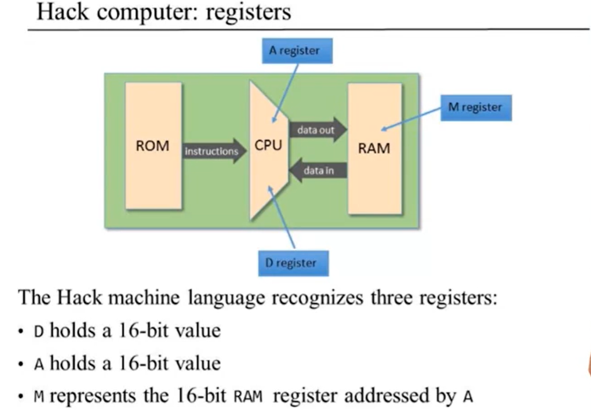

​		Hack语言规定，内存的存取指令是对隐式的内存地址“M”进行操作。`M->A, A=512, M = memory[512]`


#### 2. A-指令 (地址指令)

唯一解释的命令：@value，为A寄存器赋值

```haxe
/* value:
 *  1.非负的十进制常数≤32767(=2^15 - 1)
 *  2.指向(非负的十进制常数)的符号, eg:sum
 */
@21：
 - A寄存器赋值为21  data register
 - RAM[21]将成为选定的RAM寄存器  address register
// 二进制形式：0value
```

​		只要赋值赋值给A寄存器，A寄存器会自动从数据存储器中选中被选择的寄存器，被选择的寄存器就是上图中的M寄存器。

```haxe
// Set RAM[100] to -1
@100  // A = 100, 二进制：0value(=0000 0000 0110 0100)
M = -1  // RAM[100] = -1
```

​		此段代码，M就是代表了内存单元中的寄存器RAM[100]。这就是 A-指令 的用法，在内存的存取操作之前，我们总是要用 A-指令 去选择一个寄存器，进而完成内存的存取。


#### 3. C-指令

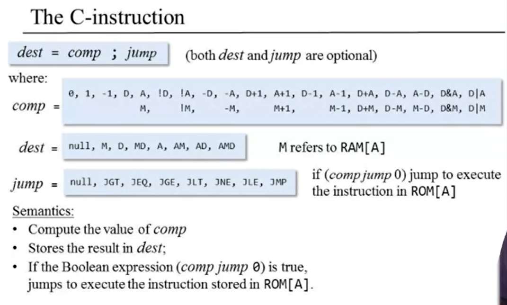

```haxe
// dest or jump are optional
// if dest is null, "=" omit
// if jump is null, ";" omit
C-instructions: dest = comp;jump
```

comp域：ALU计算什么；

dest域：计算后的结果（ALU的输出）将被存储到哪里；

jump域：接下来要取出并执行拿一条命令

```haxe
// Set the D register to -1
D = -1  // D in dest table, -1 in comp table
    
// Set RAM[300] to the value of the D register minus 1
@300  // A = 300, slect the register which I want to operate (access memory)
M = D-1  // (D-1) in comp table
    
// If (D-1 == 0) jump to execute the instruction stored in ROM[56]
@56  // A=56
D-1;JEQ  // if (D-1 == 0) go to 56.
// (D-1) in comp table, JEQ is (if out=0 then jump)
```

C-指令的二进制表示：


C-指令的compute域：

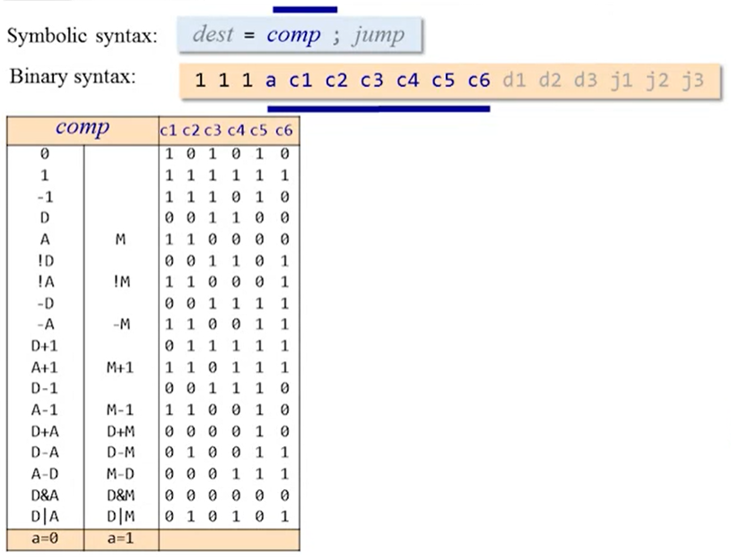


C-指令的dest域：

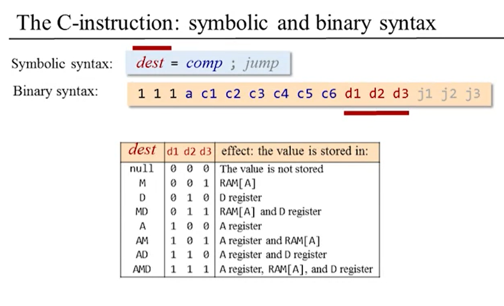

dest域为3位二进制组合，代表了8种可能。


C-指令的jump域：

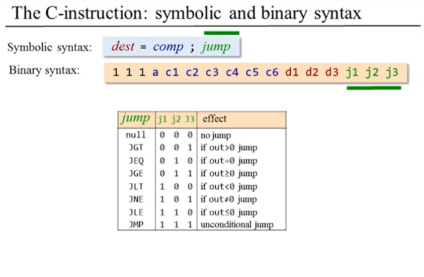与dest域相似，junp也是3位二进制组合。

特别的，最后一个指令`(0;JMP)`执行一个无条件跳转。（其实除了0，还可取任意数值）


#### 4. 符号

​		汇编命令可以使用常数或符号来表示内存单元位置（地址）。


#### 5. 输入/输出处理

Hack能连接两个外设，屏幕和键盘。两个设备与计算机的交互都是通过**内存映像(memory maps)**实现的。

这意味着在屏幕上描述像素是通过**将二进制值写入**与屏幕相关的**内存段**来实现的。

键盘的输入是通过**读取**与键盘相关的**内存单元**来实现的。

物理I/O设备和它们对应的内存映像是通过**连续的循环刷新**进行**同步**的。

#### 屏幕

​		屏幕通过电线连接计算机，如果我们追踪电线，我们可以看到它进连接了RAM的一个区域，称为屏幕内存映射。

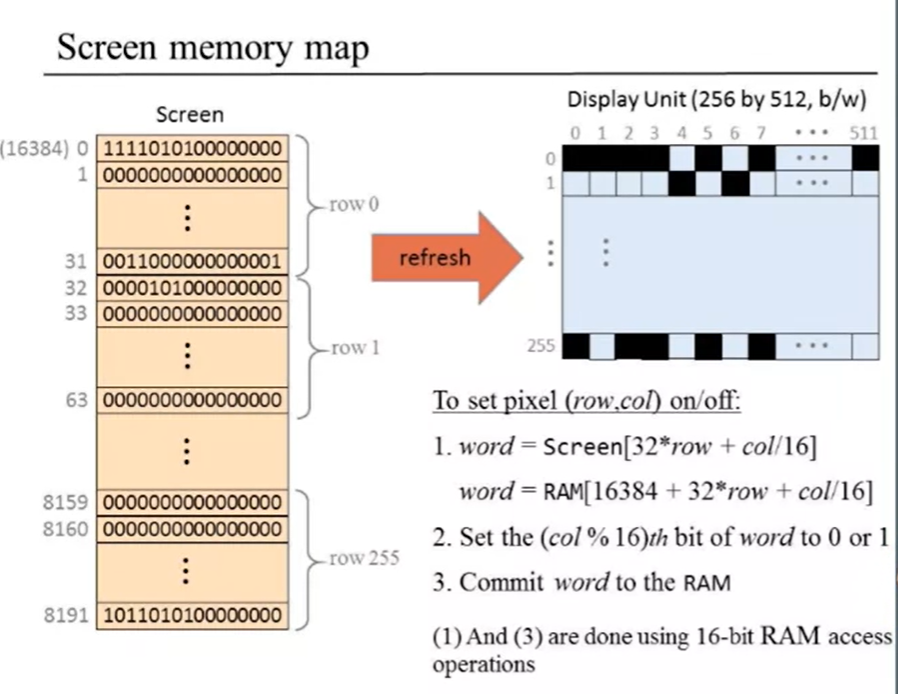

​		1 = 黑，0 = 白。而这中间的困难是，显示单元是二维的；内存映射是一维的，我们必须连接起来。我们只能从内存映射中**读写**16位数据，而无法只**操作**一个单独的位的数据。

​		对内存的存取操作都是16位，因此我们可以取出16位，对其中的1位进行操作之后，再存放。

​		另一难题，如何在内存映射出对应的行-列？

  1. `word = Screen[32×row + col/16] (整除)`

     ​		屏幕的内容由RAM**基地址**为**16384(0x4000)**的**8K** 内存映射 来表示，作用和记忆单元完全一样，对内存进行读写操作。而在整个计算机中，这个芯片将会成为数据内存的一部分，所以数据内存将由多个芯片组成。

     `word = RAM[16384 + 32×row + col/16]`

     

     ​	求解出行-列，那么如何存取16位地址块中的 哪一个 二进制数呢？

2. `col%16`得到0至15之间的数，可以对其置1或0，修改之后再保存整个16位地址。在下一个时钟周期，就可以改变屏幕显示的像素。

书上的例子：(应该是最右的元素)

```haxe
// 在屏幕的右上角换一个黑点
@SCREEN  // 将 A寄存器的值 置入 内存映射区，映射到屏幕第一行的16个像素的内存字
M = 1  // 1: (00000000000000001), 将最右边的像素变黑
```

视频上的硬件仿真器的例子：

```haxe
// eg:第3行前16列的所有像素变黑
CHIP Screen{
	IN  in[16],    // what to write
    load,          // write-enable bit
    address[13];   // where to read/write
    OUT out[16];   // Screen value at the given address   
}
// 32*3 = 96; address[13] = 96 = (0000 0000 0110 0000);
// load = 1
// in[16] = (1111 1111 1111 1111) = -1
// 写入内存后，还需要run时钟，将在下一个时钟周期刷新后显示
```


#### 键盘

​		键盘通过电缆连接计算机，如果我们追踪电缆，我们可以看到它进入了RAM的一个区域，称为键盘内存映射。

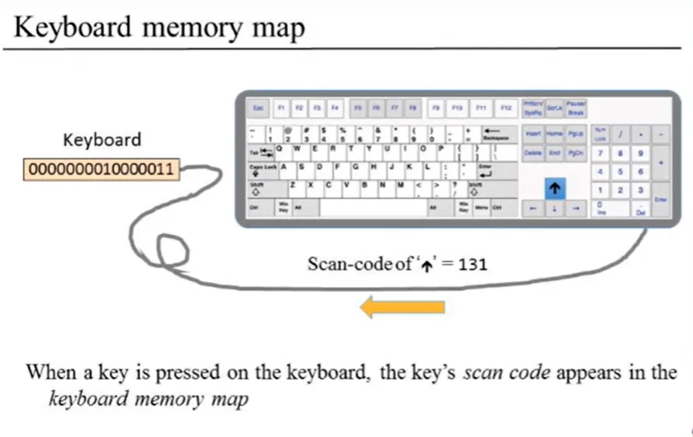

​		Hack计算机与物理键盘之间通过RAM基地址为**24576(0x6000)**的单字内存映像进行交互。只要在键盘上敲一个键，其对应的16-位**ASCII码**值就出现在**RAM[24576]**。没有敲键盘时，该内存单元的值就是**0(=0000 0000 0000 0000)**。除了常用的**ASCII码**之外，Hack键盘还可以识别：

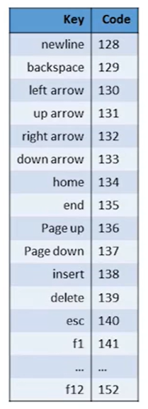

```haxe
// Read-Only
CHIP Keyboard {
    OUT out[16];   // The ASCII code of the pressed key, 
                   // or 0 if no key is currently pressed, 
                   // or one the special codes listed in Figure 5.5.
}
```

​		按下瞬间识别，松手则无键按下，置0.


### :zap::zap::zap:[机器语言实践]

**D: data register**

**A: address / data register**

**M: the currently selelcted memoty register, M = RAM[A]**

```haxe
// D = 10
@10
D=A

// D++
D+1  // D+1 in comp table of C-instruction

// D=RAM[17]
@17  // now, M=RAM[17]
D=M

// RAM[17]=0
@17
M=0

// RAM[17]=10
@10
D=A  // store the value
@17  // slelect the register
M=D

// RAM[5] = RAM[3]
@3
D=M
@5
M=D
```


Computes: RAM[2] = RAM[0] + RAM[1]

```haxe
@0  // R0 may be better
D=M

@1  // R1 may be better
D=D+M  // D+M in comp table of C-instruction

@2  // R2 may be better
M=D
    
@6
0;JMP  // end of program, use infinite loop to avoid 
```

空格在翻译时被忽略。


当我们要使用**寄存器(R0~R15)**时，利用符号表示，以获得更好的可读性：（此时A寄存器作为 address register）

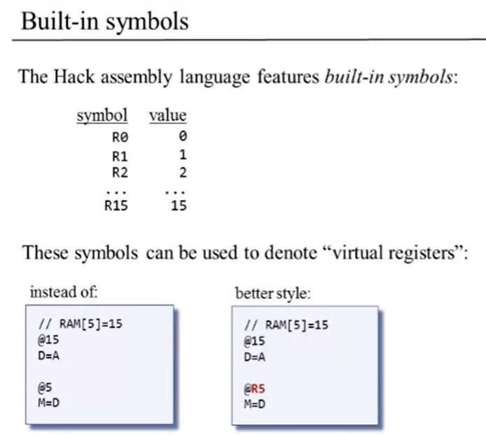

符号严格区分大小写，请只使用‘R’。


SCREEN、KBD以及其他的内置符号

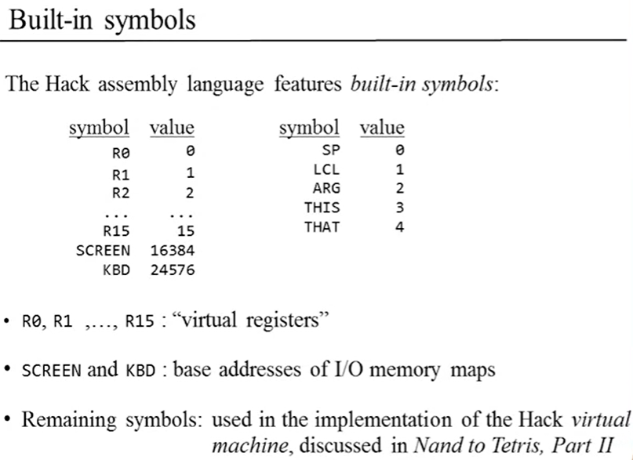

SCREEN和KBD代表的分别是：输出和输入设备内存映射的基地址。


#### [分支 Branching]

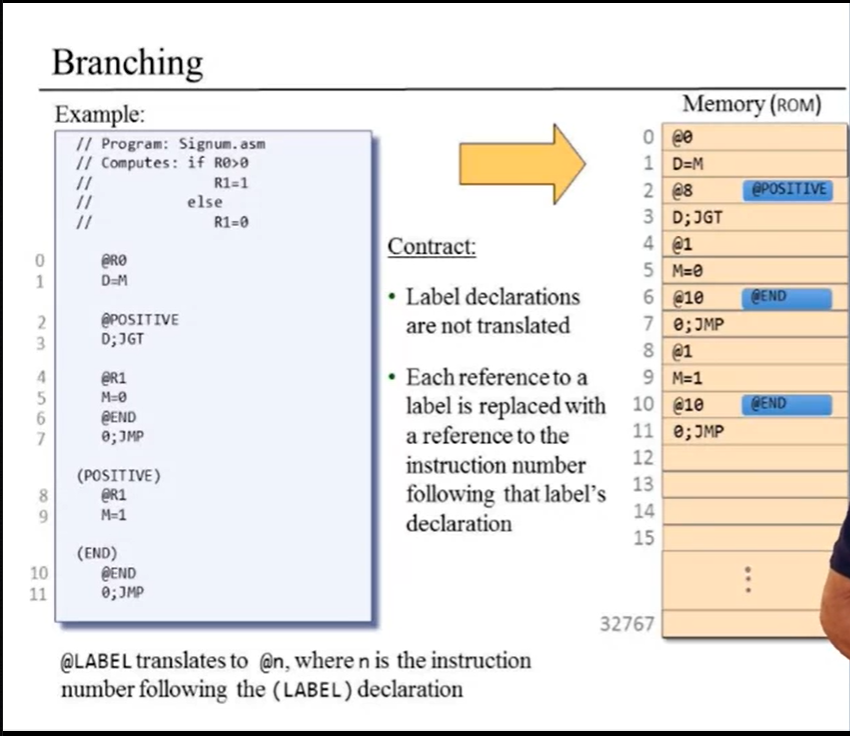

**@LABEL**会被翻译成@n，其中n是**(LABEL)**声明后的**指令号**。

(POSITIVE)是8，(END)是10


#### [Variables]

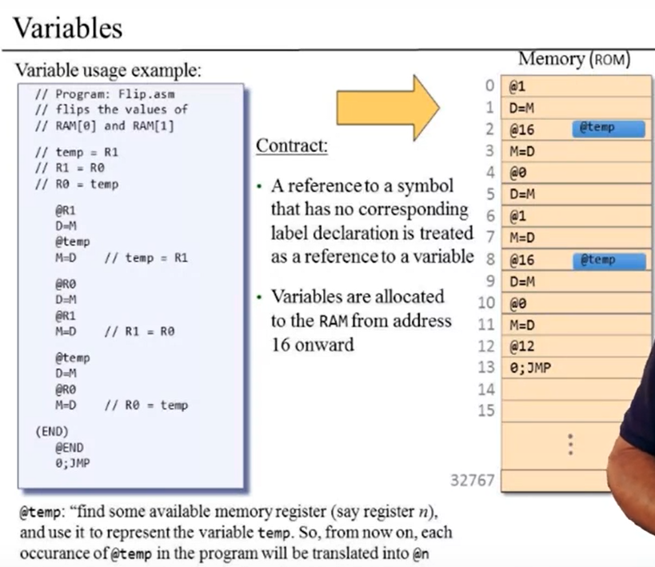

@temp变成中间变量，效果相当于@n，

@temp变量从地址16开始，可声明n个变量。


计算累加和

```c
// Computes RAM[1] = 1+2+ ... +RAM[0]
    int n = R0;
	int i = 1;
    int sum = 0;
LOOP:
    if i > n goto STOP;
    sum = sum + i;
    i = i + 1;
    goto LOOP;
STOP:
    R1 = sum; 
```

将伪代码转换成我们的Hack汇编

```haxe
// Computes RAM[1] = 1+2+ ... +n
// Usage: put a number (n) in RAM[0]

    @R0
    D=M
    @n
    M=D  // n = R0
    @i
    M=1  // i = 1
    @sum
    M=0  // sum = 0

(LOOP)
    @i
    D=M
    @n
    D=D-M  // n - i
    @STOP
    D;JGT  // jump (if) greater than; if i > n goto STOP

    @sum
    D=M
    @i
    D=D+M
    @sum
    M=D
    @i
    M=M+1
    @LOOP
    0;JMP

(STOP)
    @sum
    D=M
    @R1
    M=D  // R[1] = sum

(END)
    @END
    0;JMP
```

​	这是我们最佳的Hack汇编实践方式：

1. Design the program using pseudo code and Make sure it works.
2. Write the program in assembly language.
3. Test the program (on paper) using a variable-value trace table.


#### [指针]

```haxe
// for(i=0; i<n; i++){
// 		arr[i] = -1;
// }
// Suppose that arr=100 and n=10

    // arr = 100
    @100
    D=A
    @arr
    M=D

    // n = 10
    @10
    D=A
    @n
    M=D

    // initialize i = 0
    @i
    M=0

(LOOP)
    // if (i==n) goto END. (not STOP cause we dont intent to valuation)
    @i
    D=M
    @n
    D=D-M
    @END
    D;JEQ

    // RAM[arr+i] = -1
    @arr
    D=M
    @i
    A=D+M  // A = arr+i
    M=-1  // RAM[arr+i] = -1

    // i++
    @i
    M=M+1

    @LOOP
    0;JMP

(END)
    @END
    0;JMP
```

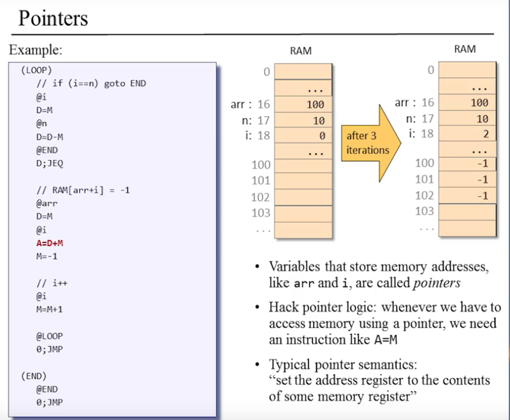

- 高级语言中，`arr`和`i`之类**存储地址**的变量称为**指针**。

- Hack指针的逻辑：无论何时，当我们必须用指针访问内存，我们需要像`A=M`的指令。（对`RAM[M]`操作）
- 将地址寄存器（A register）设置为某个内存寄存器的内容，其中我们做了一些指针运算，计算我们需要操作的地址。


#### 输入 / 输出

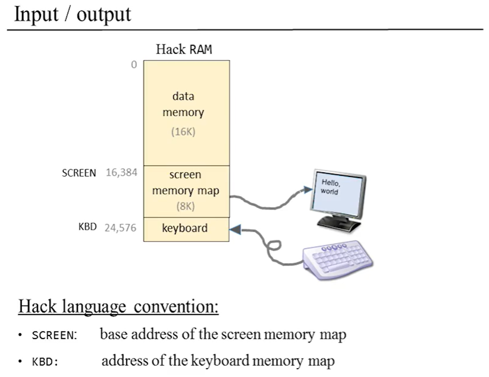

上图知识回顾。

我们需要在屏幕上画全黑的矩形，简单的思路是迭代足够多的行，让屏幕显示“黑块”。

psuedu code: 

```haxe
// for (i=0; i<n; i++){
// 		draw 16 block pixels at the beginning of row i
// }
	addr = SCREEN
    n = RAM[0]
    i = 0

    LOOP:
        if i > n goto END
        RAM[addr] = -1  // 1111 1111 1111 1111(= 16 black pixels)
        // advances to the next row
        addr = addr + 32  // 我们用内存映射的前32行代表一整行512(=32*16)个像素，每行如此
        i = i + 1
        goto LOOP

    END:
        goto END
```

实现的Hack汇编：

```haxe
   @SCREEN
   D=A
   @addr
   M=D  // addr = 16384(base address)

   @R0
   D=M
   @n
   M=D  // n = RAM[0]

   @i
   M=0

(LOOP)
    @i
    D=M
    @n
    D=D-M
    @END
    D;JGT  // if i > n goto END

    @addr
    A=M
    M=-1  // RAM[addr] = 1111 1111 1111 1111

    @i
    M=M+1  // i = i + 1
    @1
    D=A  // D = RAM[32]
    @addr
    M=M+D  // addr = addr + 32
    @LOOP
    0;JMP  // goto END

(END)
    @END  // program's end
    0;JMP  // infinite loop
```


##### 键盘

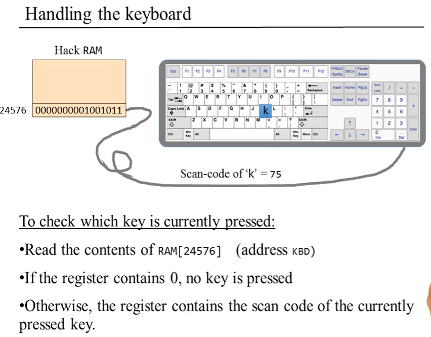

- 读出RAM[24576]的内容
  - 如果寄存器存储了0，说明无键输入；
  - 否则，寄存器存储了现在按下的键的**键盘扫描码**。


#### [Project]

##### 1. Mult

a program performing `R2 = R0 * R1`.

pseudo code:

```haxe
	sum = 0
    i = RAM[0]

    LOOP:
        // This is assembly, may be variable 'i' isnt so necessary like C program, can use RAM[0] directly.
        if i ≤ 0 goto STOP  
        i = i - 1
        sum = sum + RAM[1]
        goto LOOP

    STOP:
        RAM[2] = sum
        
    END:
        goto END
```

impletement: mult.asm

```haxe
// This file is part of www.nand2tetris.org
// and the book "The Elements of Computing Systems"
// by Nisan and Schocken, MIT Press.
// File name: projects/04/Mult.asm

// Multiplies R0 and R1 and stores the result in R2.
// (R0, R1, R2 refer to RAM[0], RAM[1], and RAM[2], respectively.)

// Put your code here.

    @sum
    M=0
    @R0
    D=M
    @i
    M=D
    @R2
    M=0

(LOOP)
    @i
    D=M
    @STOP
    D;JLE  // jump less equal; if R[0] <= 0 goto STOP
    @i
    M=M-1  // i--

    @R1
    D=M
    @sum
    M=M+D  // D = sum + R[0]
    @LOOP
    0;JMP

(STOP)
    @sum
    D=M
    @R2
    M=D  // R[2] = sum

(END)
    @END
    0;JMP
```


##### 2. Fill

持续监听键盘输入，只要有任何键被按下，屏幕全黑；只要松开按键，屏幕恢复全白。

pseudo code:

```haxe

```

