# [计算机体系结构 Computer Architecture]

本章涵盖“硬件”部分中最难啃的内容。将第1~3章构建的所有芯片整合并集成一台通用计算机Hack。

Hack优点：

1. 通过前面构建的芯片可以几小时构建完成。
2. Hack计算机的体系结构足以描述任何数字计算机的关键操作原理和硬件组成。

**This chapter is more Complicated than previous.**

### [背景知识]

#### 1. 存储程序概念

​		一个由有限硬件组件构成的计算机却可以执行无限的任务队列，其实都是**“存储程序(stored program)”**概念的硕果。计算机基于固定的硬件平台，能够执行固定的指令集。同时，这些指令能够被当成构建模块，组成任意的程序。而且，这些程序的逻辑被存储到计算机的**存储设备(memory)**里，跟数据一样，成为所谓的**“软件(software)”**。

#### 2.冯·诺伊曼结构

​		存储系统概念最著名的是**通用图灵机(1936)**和**冯·诺伊曼机(1945)**。

​		图灵机描述虚拟的简单计算机的抽象机，主要用来分分析计算机的逻辑结构。相比之下，冯·诺伊曼机是实际应用型的体系结构，是今天所有计算机结构的基础。

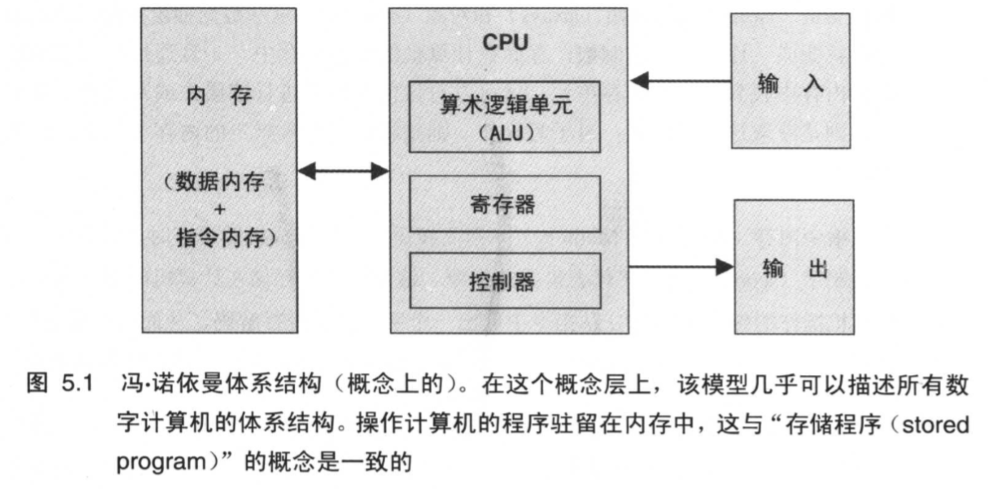

​		冯·诺伊曼体系结构的基础是一个**中央处理单元(CPU, Central Processing Unit)**，它与**记忆设备(memory device)**即**广义的内存**进行交互，负责从**输入设备(input device)**接收数据，向**输出设备(output device)**发送数据。体系结构的核心是存储程序的概念：计算机内存不仅存储着要进行操作的数据，还存储着指示计算机运行的指令。

​		广义的内存代表任何具有存储功能的设备和组件。

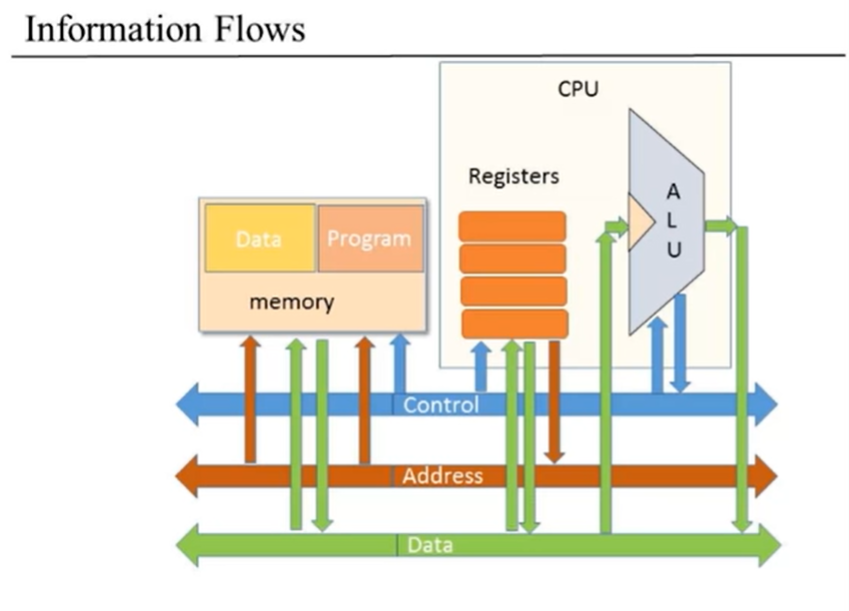

​		Data、Address、Control这三部分的每一段信息都由电线实现，通过一组公共总线。公共电线分别有数据总线、地址总线、控制总线。

​		首先是数据总线和`ALU`的交互，输入数据进行算术运算或逻辑运算，得出结果再输出到数据总线，然后到**内存(memory)**或**寄存器(registers)**。

​		控制总线。`ALU`需要知道它每次运行的是什么操作，所以它必须从控制总线中重新获取信息，指定它所要进行的操作类型。通过条件分支或循环条件决定下一个指令是什么？这种控制通过控制位(sel)实现, 所以我们需要从`ALU`中获取控制信息反馈到控制系统的其他部分。

|   ————   |                          CPU中的ALU                          |         CPU中的Registers         |        内存Memory        |
| :------: | :----------------------------------------------------------: | :------------------------------: | :----------------------: |
| 数据总线 | 往`ALU`输入数据进行算术运算 / 逻辑运算，`ALU`输出运算结果，再反馈到其它 |               读写               |           读写           |
| 地址总线 |                             ————                             | 间接寻址到RAM或者跳到一个ROM地址 |       下图一和图二       |
| 控制总线 | 往`ALU`输入控制位(sel)决定`ALU`将要进行的运算操作类型；通过条件分支或循环条件决定下一个指令，获取控制信息反馈到控制系统的其他部分。 |     反馈到控制系统的其他部分     | 反馈到控制系统的其他部分 |

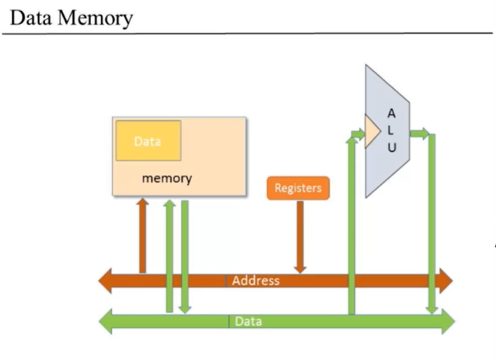

​		根据地址得到需要操作的数据块，并对其进行读写操作。

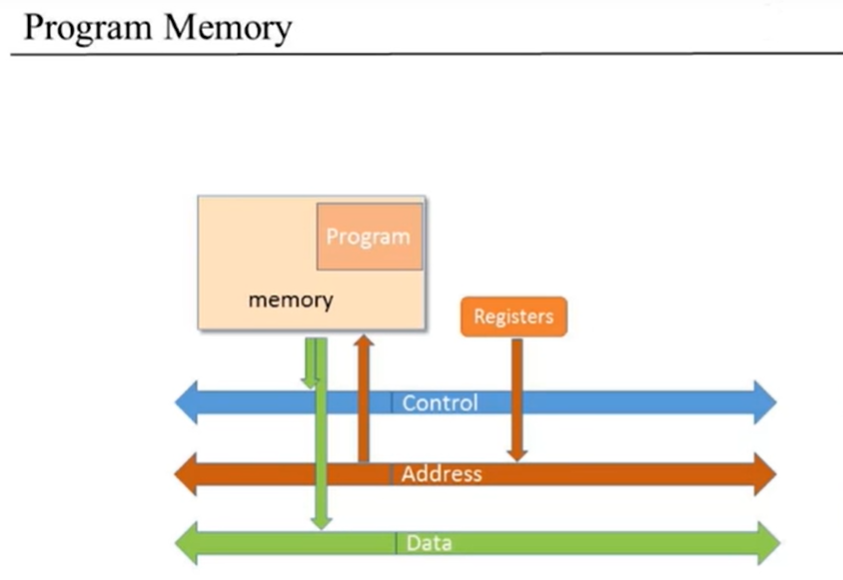

​		需要将下一个程序指令的地址输入到**程序内存**，因为这是我们使用程序指令的地方，放置地址后，从那里得到指令，也可能是数字。程序内存中的指令告诉系统的其他部分该做什么，所以我们需要从下一个指令中获取信息，也即从程序内存的数据输出，并将其输入到控制总线。

#### 3. 内存

​		冯·诺伊曼机的内存中存有两种类型的信息：**数据项(data items)** 和 **程序指令(programing instructioins)**。采用不同方式处理两种信息，并被分别存储到不同的内存区，尽管功能不同，但都以二进制数形式存储在具有通用结构的**随机存取器(RAM)**。一个单独的字（一个数据项或者一条指令）通过它的地址指定。

- 数据内存        高级程序操纵的抽象组件，例如变量、数组和对象。这些数据抽象被翻译成机器语言后，变成一连串的二进制数，存储在数据内存。通过指定的地址进行读写操作。
- 指令内存        高级指令 如上类似处理，并被存储在指令内存。计算机每一步操作，CPU从指令中取出一个字，对其进行解码，从而执行指定的指令，然后计算下一条将要执行的指令。
  - 指令内存中的指令格式遵守机器语言的规则。

#### 4. 中央处理器

​		CPU是计算机体系的核心，负责执行已被加载到指令内存的指令。CPU通过使用三个主要的硬件执行指令：**算术逻辑单元(ALU, Arithmetic-Logic Unit)**，一组**寄存器(registers)**和**控制单元(control unit)**。

- **算术逻辑单元（ALU）**		ALU 负责执行计算机中所有底层的算术操作和逻辑操作。
- **寄存器（Registers）**          CPU 的设计是为了能够快速地执行简单计算。与运算相关的数据暂存到高速寄存器，远比从内存搬进搬出快得多。
- **控制单元（Control Unit）** 计算机指令用二进制数表示，通常具有16、32或64位宽。在指令可被执行之前，要对其进行解码，指令包含的信息向不同的硬件（ALU，寄存器，内存）发送信号，指使它们如何执行指令。指令解码过程是通过某些**控制单元**完成的。这些控制单元还负责决定下一条读取和执行哪一条指令。

#### 5. 寄存器

​		内存访问是很慢的过程。当`CPU`被指示去取内存中地址`j`的内容时，会连续发生以下操作：

​			(a)  `j`从`CPU`传到`RAM`;

​			(b)  `RAM`的**直接访问逻辑(direct-access logic)**选中地址为`j`的寄存器;

​			(c)  `RAM[j]`的内容传回到`CPU`;

​		寄存器也能提供同样的数据访问功能， 但没有开会的数据传递和寻址开销。

- 寄存器位于`CPU`内部，所以对它们的访问几乎可以瞬间完成

- 与数百万个内存单元相比，寄存器数量非常少，机器语言指令可以使用短短几个位就能指定要操作的寄存器在什么位置，指令格式也会更短。

  ​	

  不同的目的，不同的`CPU`采用不同数量、不同类型的寄存器。

- **数据寄存器(Data registers)**		为`CPU`提供短期记忆(memory)服务。例如计算`(a+b)*c`，必须先计算`(a+b)`的值并储存，可以暂存`(a+b)`到数据寄存器。

- **寻址寄存器(Addressing registers)**   为了进行读写，`CPU`必须连续访问内存中的数据。这样我们必须确定被访问的**内存字(word)**所在的内存地址。由上条指令得出的地址，地址会被存储在**寻址寄存器**。

- **程序计数寄存器(Program counter register)**  执行程序时，`CPU`必须总是知道下一条指令在指令内存中的地址，地址保存在**程序计数寄存器(PC, Program Counter)**中。`CPU`通过两种方式更新`PC`的内容：

  - 如果当前指令存在需要执行的`goto n`命令，则`CPU`将`PC`置为`n`；
  - 否则，`PC`增1以便指针指向程序中的下一条指令。

#### 6.输入输出

​		计算机使用一组**输入输出(I/O)设备**来与其外部环境进行交互。**不考虑**设备本身的构造，每个设备代表一块独立的机器，需要相关的工程知识；CSer设计不同方案将不同外设的**物理细节封装**，让计算机以相同的方式对它们进行操作，其中最简单的实现技巧之一就是**I/O映像(memory-mapped I/O)**。

​		I/O映像的基本思想是：创建I/O设备的二进制仿真，使其对于`CPU`而言，“看上去”就像普通的内存段。

### Hack 硬件平台规范详述

#### 1.概述

​		Hack平台是16-位冯·诺伊曼机，一个`CPU`、两个独立的内存模块（指令内存和数据内存）和两个内存映像I/O设备（屏幕和键盘）。

​		Hack计算机执行位于指令内存中的程序。指令内存是只读设备，可以用ROM芯片实现。加载新的程序意味着要替换整个ROM芯片。HACK平台的硬件仿真器提供了**加载文本文件**的方法，文本文件包含用**Hack机器语言**编写的程序（从新在开始，**分别用RAM和ROM来指代Hack的数据内存和指令内存**）。因此两个独立的内存模块为：RAM和ROM。

​		Hack的CPU由**ALU**和三个分别称为**数据寄存器(D, data regiter)**、**地址寄存器(A, address register)**、**程序计数器(PC, program counter)**的寄存器组成。

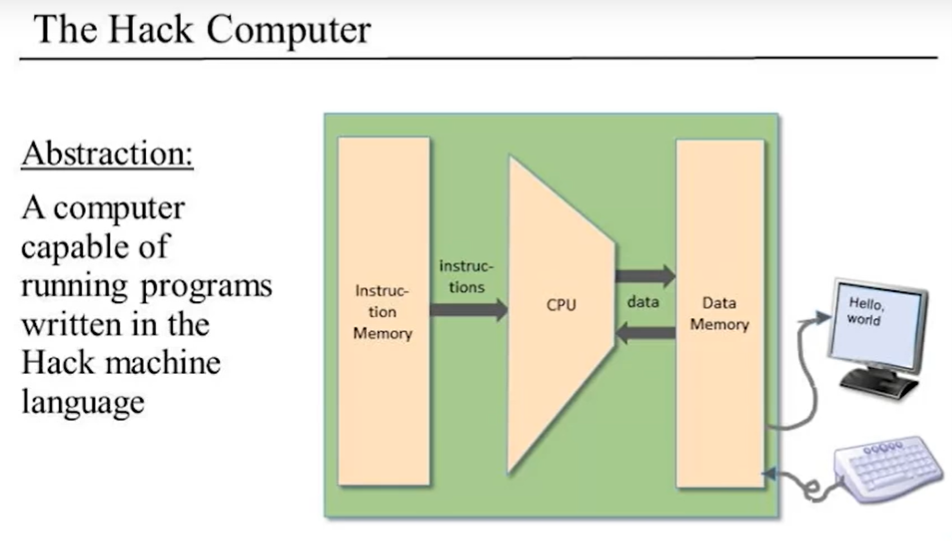

……省略约3000字，请仔细看书🤣

### [实现]

- **Memory**：内存，包括数据内存和指令内存，屏幕内存映像和键盘内存映像
- **CPU**：包含A寄存器，D寄存器，ALU，PC程序计数器
- **Computer**：完整的一个计算机平台。运行在仿真平台上

#### Memory：

输入管脚：`in[16]`, `load`,` address[15]`
输出管脚：`out[16]`
Memory芯片主要由三个底层芯片构建：RAM16K，Screen，KeyBoard。同时我们必须通过这三个底层芯片来实现一个统一的逻辑地址空间，这个空间从地址0到24567。

- 构建这个连续的地址空间的方法我们可以参考之前第三章由小RAM构建大RAM的方法。
- 内存的功能首先能够根据`address`选定需要进行操作的单元。
- 然后将`load`信号给指定的内存单元。根据`load`信号判断是进行写入还是继续保持。
- 下面进行地址连线：（注意此地址只有15位 -> address[15]）
  - RAM16K:  (0~16383) -> (**0**00 0000 0000 0000) ~ ‭(**0**11 1111 1111 1111‬)
  - Screen:  (16384~24575) -> (**10**0 0000 0000 0000) ~ ‭(**10**1 1111 1111 1111‬)
  - Keyboard: 24576 -> (**11**0 0000 0000 0000)

1. 首先根据地址进行判断**(00, 01, 10, 11)**，应该将控制信号发送给`RAM`, `Screen`, `Keyboard`中的哪个地址空间。可以使用 `DMux`解复用 实现‬（将一个地址分发到不同的芯片）。

   1. 由地址的第15位选择输出，区分出 **RAM(0)** 和 **内存映射区(1)**, 实际输出还是load = (0/1).
   2. 再由 **内存映射区(1)** 对应地址的第14位进行选择，区分出 **Screen(0)** 和 **Keyboard(1)**, 实际输出还是load = (0/1)

   - 由于所给出的地址空间不会超过`110 0000 0000 0000`‬，所以我们只需要进行一次判断就可以了，而不用考虑后面13位的判断。

2. 然后将输入数据`in`，由`上个步骤`得出的**控制信号**和**片内选择地址(RAM: 0~14bit, Screen: 0~13bit, Keboard: 1bit)**给对应的芯片处理即可。Screen和Keyboard芯片都是内置好的，因此直接调用接口即可。

#### CPU

输入管脚：`inM[16]`, `instruction[16]`, `reset`
输出管脚：`outM[16]`, `writeM`, `addressM[15]`, `pc[15]`
CPU实现的一种推荐方案：

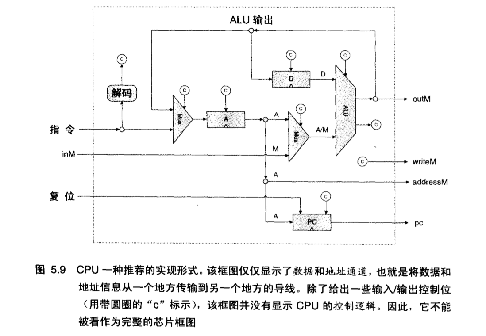

1. ALU
2. 三个寄存器：A-Register、D-Register、PC
3. 两个Mux（多路复用器）
4. 利用输入的指令的规范逻辑完善`c`标签（不同芯片的控制位）的逻辑，即可实现CPU

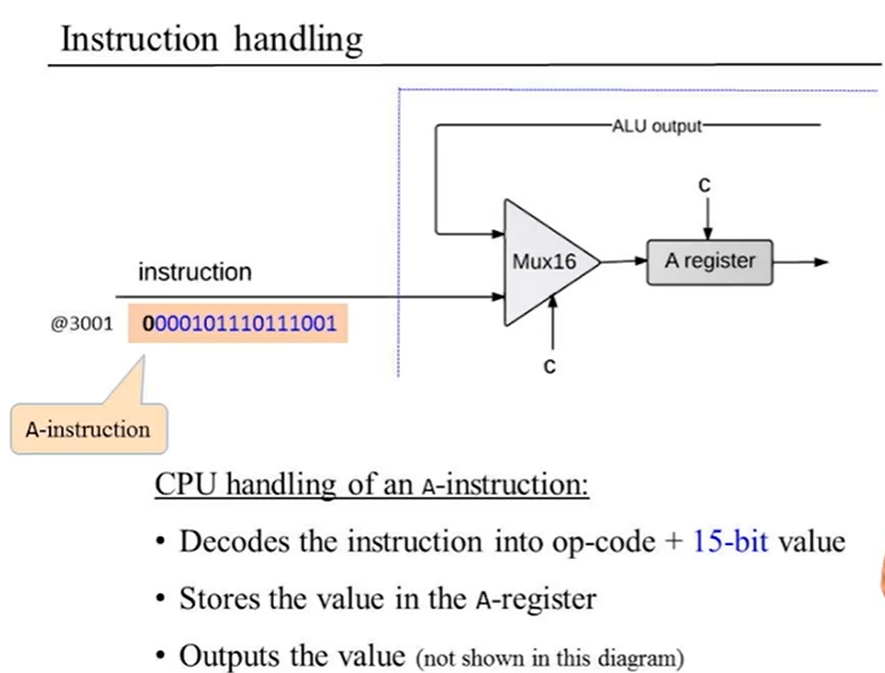

​		对指令解码的逻辑，对MSB(0/1)进行区分A-指令和C-指令，提取出另外的15-bit。A-指令保存在`A Register`，C-指令还需继续解码。

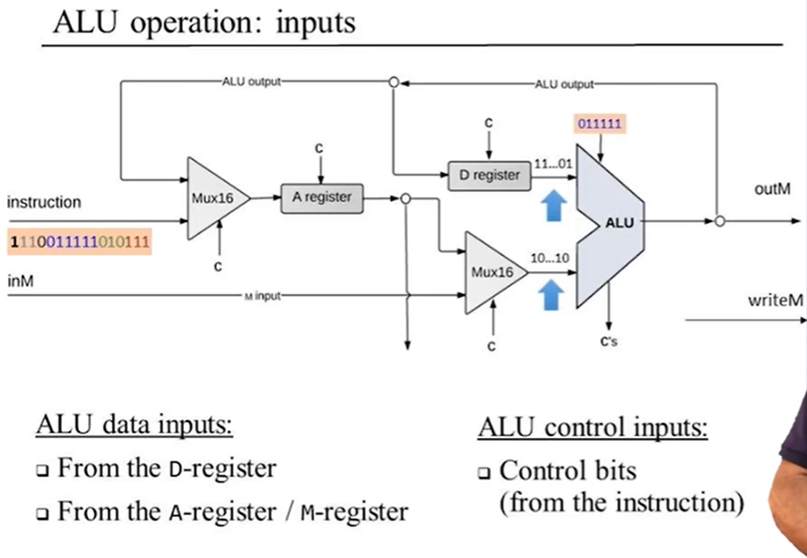

​	ALU的数据输入：D-register、A-register/M-register

​	ALU根据`comp`域 **控制**输入**执行**哪一个运算函数。

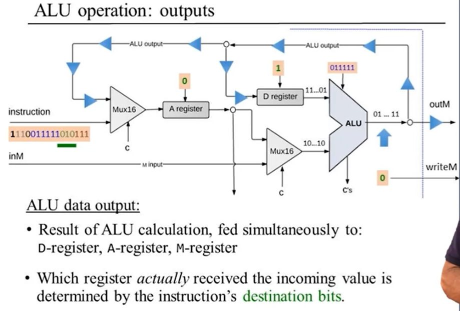

​	ALU数据输出：D-register，A-register，M-register

​	ALU根据`dest`域 **控制**输出**写入**哪些寄存器

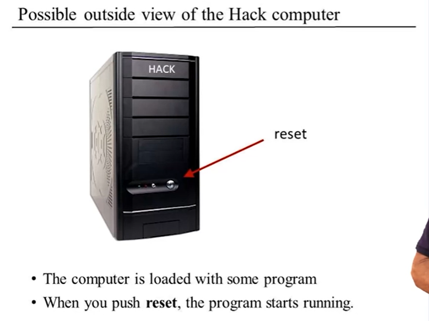

​	计算机已经载入了程序，当按下`reset`，程序开始运行，重启也可。**(PC=0)**

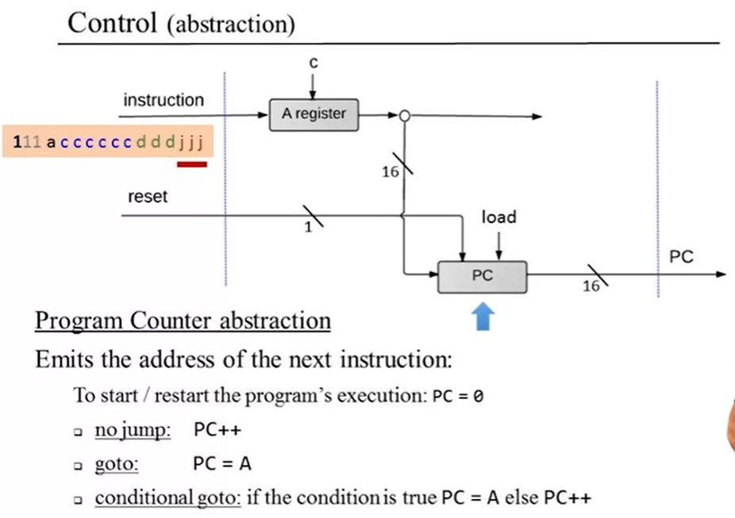

​	PC概念：总是发送下一个指令的地址；由指令的`jump`域控制PC的输出

- 开始/重启程序的执行，`reset = 1, PC = 0`
- 程序不跳转，`jump = (000), PC++`
- 程序无条件跳转，`jump = (111), PC = A`
- 程序有条件跳转（判断条件是否满足再跳转），`jump = 1~3个1, PC = A`

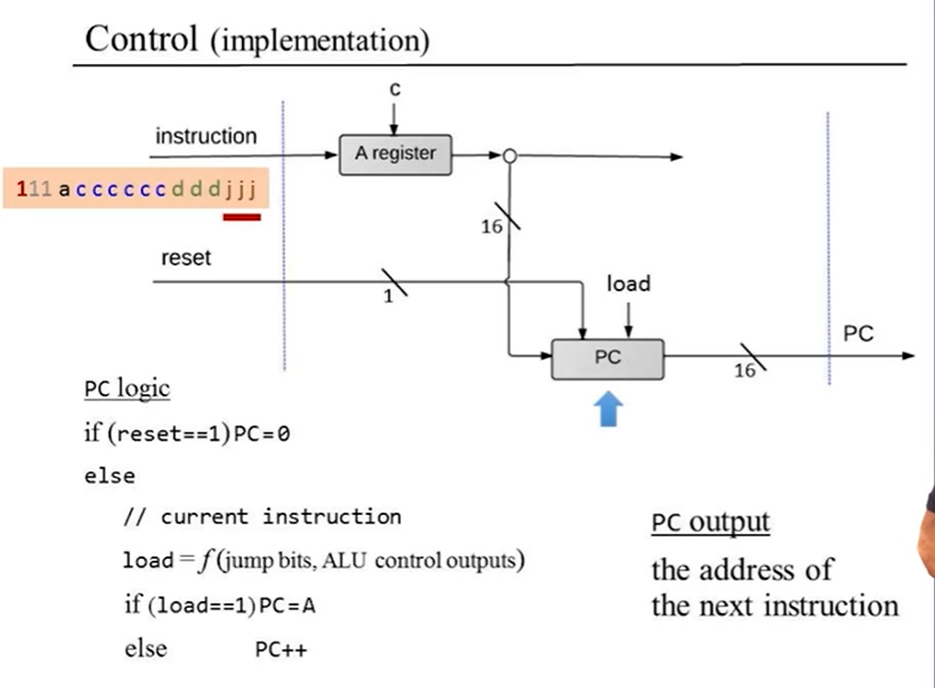

​	PC的实现：

- `reset`是否为1？
- `load`由`jump`域的3-bits和**ALU的控制输出(ZR、NG)**决定
- `load = 1, PC = A; load = 0, PC++`

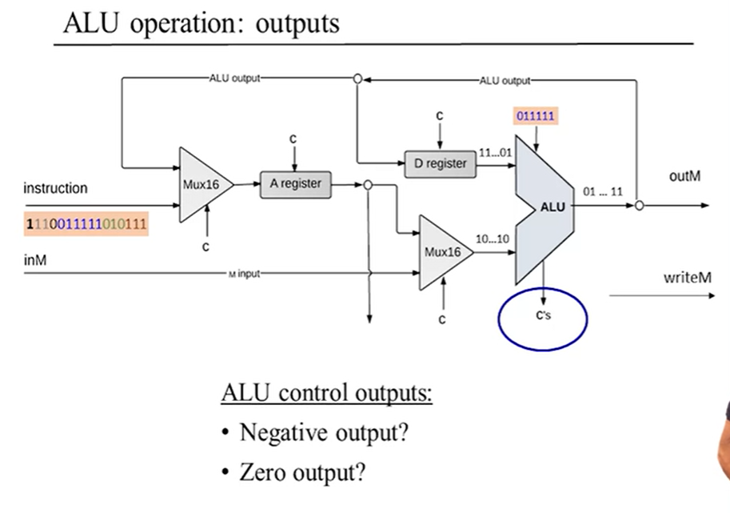

​	**ALU的控制输出(ZR、NG)**: 输出是0时，`ZR = 1`、输出是负数时，`NG = 1`

##### 指令格式

对指令进行**解码**，需要回顾一下第四章规范的指令格式：
**A-指令**：
$$
0vvv~~vvvv~~vvvv~~vvvv
$$
`MSB`: 0，其余15位表示地址值，存入`A Register`.

 **C-指令**：
$$
111a~~c_1c_2c_3c_4~~c_5c_6d_1d_2~~d_3j_1j_2j_3
$$

- `MSB`: 1，紧接着的两位无意义；

- `a`位域：控制与`D Register`进行计算的是`A Register`还是`M Register`；
- `comp`域：控制运算操作和逻辑操作，具体参考图4.3；
- `dest`域：控制目标存储位置，**d~1~**控制是否将ALU的计算结果存入`A Register`中，**d~2~**控制是否存入`D Register`中，**d~3~**控制是否存入`M Register`中;
- `jump`域：控制（有条件/无条件）跳转。

##### 解码指令

​		如果是A-指令，那么无论如何都要将地址加载到A寄存器中；如果是C-指令，则需要考虑**d~1~**，是否(1/0)需要将ALU的计算结果保存在A寄存器中。

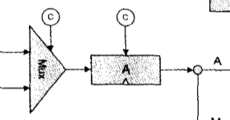

​		不妨暂时将第一个Mux的控制位记为**c~m~**，将A寄存器的控制位记作**c~a~**。

​		**c~m~**用于区分**A**-指令**(0-vvv)**和**C**-指令**(111-)**；**c~a~**用于控制是否写入`A Register`.

那么我们可以得到真值表：

| Instruction   | Instruction[15] | d~1~ | c~m~ | c~a~ |
| ------------- | :-------------: | :--: | :--: | :--: |
| A-instruction |        0        |  0   |  1   |  1   |
| A-instruction |        0        |  1   |  1   |  1   |
| C-instruction |        1        |  0   |  0   |  0   |
| C-instruction |        1        |  1   |  0   |  1   |

由真值表我们可以得到控制位**c~m~**和**c~a~**的公式：
$$
c_m~=~\overline{Instruction[15]},~c_a~=~\overline{Instruction[15]·\overline{d_1}}
$$
对于A-指令以上的工作就已经足够了。而对于C-指令我们还需要做其他的工作。

##### C-指令的解码

​		C指令的d~1~位已经被解析完了，接下来从左向右开始解码。

-  ***a***是控制选择**A/M**的控制位，所以它应该在第二个Mux，注意要与`MSB`**取与**操作，确保为C-指令。

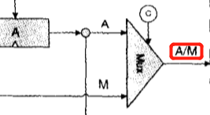

- **d~2~**是控制计算结果是否保存在`D Register`中的，所以它与`MSB`**取与**操作后，作为控制信号给`D Register`；

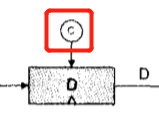

- **c~1~~c~6~**是控制ALU的运算函数的，所以它们应该作为ALU的控制位。

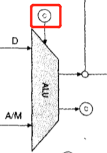

- **d~3~**是控制计算结果是否保存在`M Register`中的，所以它作为输出与`MSB`**取与**操作后，输出给writeM；

- ***j*~1~, *j*~2~, *j*~3~**是控制跳转的，总体上来看，只有两种现象，一种是顺序执行，即PC+1；另一种是跳转到地址为`A Register`中的地址单元。根据课本给出的编码：

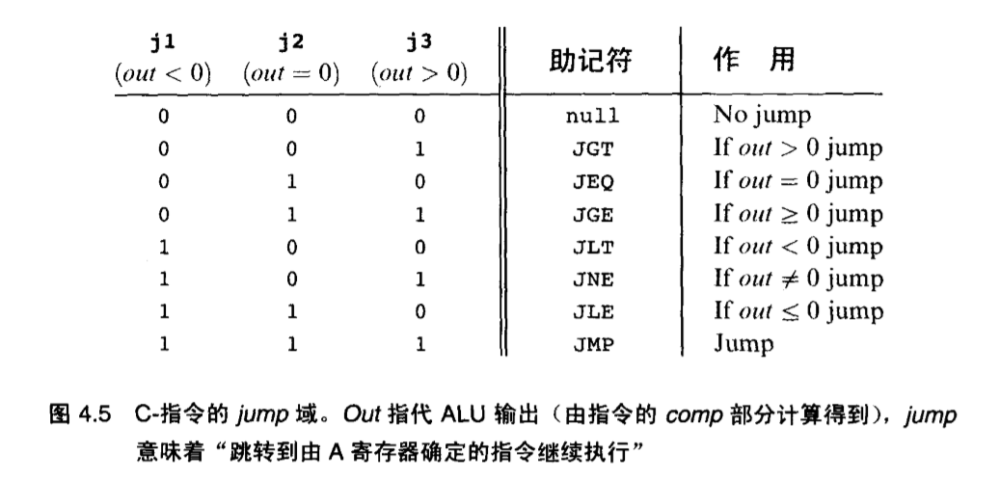

​		那么究竟是否需要跳转要根据ALU的计算结果进行判断呢？

​		ALU有两个**控制**输出信号：zr（当计算结果等于0时为1）对应 **j~1~**，ng（当计算结果小于0时为1）对应 **j~2~**；所以我们可以推出：$\overline{ng~+~zr}$（当计算结果大于0时为1）对应 **j~3~**

​		结合`jump`域和ALU的输出结果，可以得到如下真值表：

| (j~1~&ng) Or (j~2~&zr) Or (j~3~& $\overline{ng~+~zr}$) | load | inc  |
| :----------------------------------------------------: | :--: | :--: |
|                           0                            |  0   |  1   |
|                           1                            |  1   |  0   |

