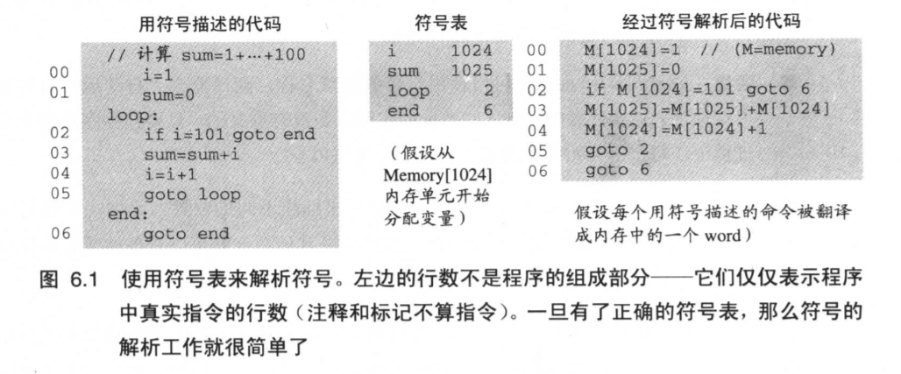
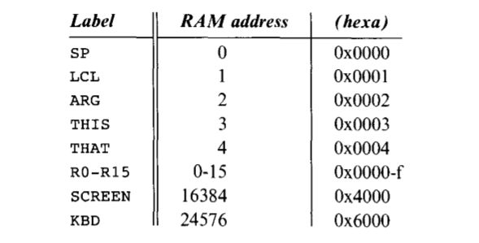
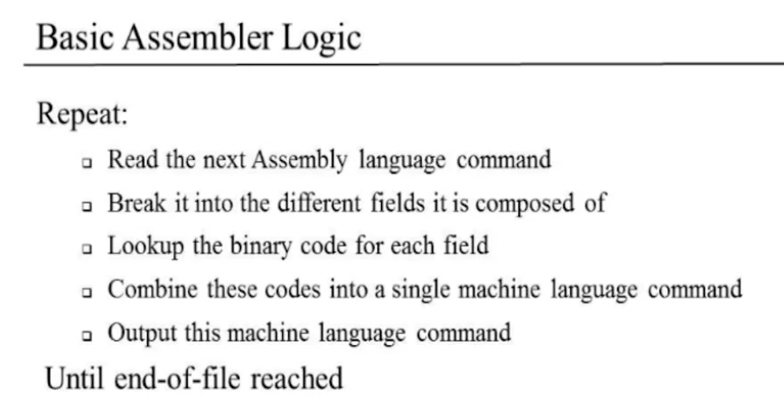

# [汇编编译器 Assembler]

​		我们已经完成了计算机的**硬件平台(hardware platform)**，此后我们将集中探讨计算机的**软件阶层体系(software hierarchy)**，直到最后为简单的面向对象编程语言开发**编译器**和**基本的操作系统**为止。

​		在软件阶层体系中，最基本的模块就是**汇编编译器(assembler)**。在C4中介绍了机器语言的两种表达形式，即**汇编形式**和**二进制形式**。在这里我们将了解编译器如何系统地将汇编语言编写的程序**翻译**成二进制形式。

​		因为**符号化汇编命令(symbolic assembler commands)**与其对应的二进制代码之间的关系很简单，唯一的复杂性在于：**允许汇编程序使用符号来指代内存地址**。我们希望通过编译器来管理这些**用户自定义的符号(symbols)**，将它们解析成物理内存地址。一般使用**符号表(symbol table)**来完成这个任务，这种符号表是经典的数据结构，应用在很多软件编译过程中。

### [背景知识]

#### 1. 符号(Symbols)

​		符号在汇编程序通常有两个用途：

- **变量(Variables)**：**程序员可以使用符号的变量名称，翻译器会“自动地”为其分配内存地址**。这些地址的实际值是没有意义的，只要在程序的整个编译过程中，**每个符号始终被指代为同一内存地址**即可。

- **标签(Labels)**：**程序员可以在程序中用符号来标注不同的位置**。比如，可以用标签`loop`来指代特定代码段的起始位置。程序中的其它指令就可以有条件或无条件地执行`goto loop`指令。

  ​		用户定义的**变量名称**和**符号标签(symbolic labels)**，与实际内存地址的映射则不是这么简单。确定符号地址的任务是从用硬件层级上升到软件层级过程中遇到的第一个挑战。

- **符号解析(Sybol Resolution)**：如下图，该程序包含4个用户自定义的符号：2个变量名称(**i**和**sum**)；2个标签(**loop**和**end**)。***如何系统的将符号转换为不含符号的代码呢？***制定两个任意性的**规则**：

  1. **翻译后的代码**将被存储到计算机中**起始地址为0的内存**中；

  2. **变量**将会被分配到**起始地址为1024的内存**中（这些规则依赖于特定的目标硬件平台）。

  - 数据结构处理方式：构建一个**符号表(symbol table)**. 在源代码中，每遇到一个新符号***xxx***，就在符号表中添加一行**(*xxx***, ***n*)**。*n*是分配给对应符号的内存地址。符号表建立完成后，利用他来将程序翻译成无符号的版本。

​	如上，符号表的各项键值对 对应了源代码中的自定义符号。只是最后一句需要解释一下，代表了无限循环`end:  goto end`.

​	其中，有3个要点需要说明。

1. 我们定义的变量分配的规则决定了能运行的程序**最多**只能有1024条指令。为了不使实际程序（如操作系统）**溢出**到符号表，存储变量的基地址应该**更远**一些。**(base address>>1024)**
2. **“每条源代码命令映射到一个字(word)”**的假设过于天真。一般情况下，某些汇编指令(`if i = 101 goto end `)会被翻译成几条机器指令，因此每条源代码会占据好几个内存单元。为了解决此问题，翻译程序会记录每条源代码产生的字的个数，然后相应的更新它的**“指令内存计数器(Insvachion memory counter)”**.
3. 对于**“每个变量用一个单一的内存单元来表示”**的假设可能也不实际。编程语言支持**多种类型的变量**，各自占用着**不同的内存空间**。因此，当为变量分配内存空间时，翻译程序必须考虑他们的**数据类型**和**硬件内存单元的宽度**。

#### 2.汇编编译器(Assembler)

​		汇编编译器将汇编程序翻译成计算机的二进制机器语言，才能被计算机执行。生成的代码被加载到计算机的内存中然后被硬件执行。

​		可见，汇编编译器实际上主要是个文本处理程序，设计目的是提供翻译服务。因此我们要有完整的汇编语法说明文档和相应的二进制代码。有了这样的约定（通常称为机器语言规范），让每个符号命令执行下面的任务：

- 解析出符号命令内在的**域**。（解析）

- 对于每个域，**产生**机器语言中相应的**位域**。（代码生成）

- 用内存单元的**数字地址**来**替换**所有的**符号引用**。（符号处理）

- 将二进制码**汇编**成完整的机器指令。（汇编）

  其中三个任务（解析、代码生成和汇编）是相当容易实现的。而符号处理则相对复杂，是汇编编译器的主要功能。(——符号表)

### [Hack 汇编到二进制的翻译规范详述]

​		总的来说，Assembler是一个翻译挑战，从源语言到目标语言。为了做到这点，我们必须知道两种语言的语法。

#### 1. 语法规约和文件格式

**文件名称**		习惯上，二进制机器码程序后缀名为“Hack”，汇编代码程序的后缀名为“asm”。因此，Prog.asm文件会被汇编翻译器翻译成Prog.hack文件。

**二进制代码(.hack)文件**		二进制代码文件由**文本行**组成。**第一行由16个0/1组成的ASCⅡ码构成一个序列，该序列对一个单一的16-位机器语言指令进行编码**。当机器语言程序被**加载**进计算机的**指令内存**中时，文件的**第n行二进制码**被存储到**地址为n**的指令内存单元内（设命令行的技术和指令内存的起始地址都是从0开始）。	

**汇编语言(.asm)文件**		由**文本行**组成，每一行代表一条**指令(instrution)**或者一个**符号声明(symbol declaration)**.

- **指令(Instrution)**		A-指令或C-指令
- **(Symbol)**		**该伪命令将Symbol绑定到该程序中下一条命令的地址上**。因为它并**不产生机器代码**，所以称之为**“伪代码(pseudo-command)”.**      (eg: (END))

（下面的语法仅适用于汇编程序）

**常数(constants)和符号(Symbols)**		常数必须是**非负**的，用**十进制**表示。用户定义的符号可以由字母、数字、下划线(_)、点(.)、美元符号($)和冒号(:)组成的字母序列，但是**不能以字母开头**。

**注释**		以两条斜线(//)开头的文本行，注释不会被计算机执行。

**空格**		空格字符和空行被忽略。

**大小写习惯**		**所有的汇编助记符必须大写**。用户**自定义**的符号和变量是**区分大小写**的。一般的习惯是，**标签(labels)大写**，**变量名称小写**。

#### 2. 指令

Hack计算机包含两种指令类型，分别称为**寻址指令(A-指令, Addressing Instrution)**和**计算指令(C-指令, Compute Instruction)**。指令格式如下：

#### 3. 符号

Hack汇编命令通过使用**常数**或**符号**来指代**内存单元*(地址)***

> 从C6开始，若未经特殊说明，内存单元可以用名词“地址”代替，如变量Value的地址是0X5B46，这包含两层意思：
>
> 1）说明Value的物理地址是数值0X5B46；
>
> 2）**Value代表的变量存储在地址为0X5B46的内存单元中**。
>
> MOV  AX，Value   等价于  MOV  AX，(0X5B46)

汇编程序中的符号来源于三个方面。

**预定义符号(Predefined Symbols)**		任何Hack程序允许使用下面的预定义符号。

**标签符合(Labels Symbols)**		伪命令(Xxx)定义符号Xxx来指代存有程序中下一条命令在指令内存中的地址。每个标签只能定义一次，可以在任何地方使用，甚至在定义之前。有两种实现方法：

1. 先存储Symbol到符号表(但不知道它在哪里)，当真正遇到正确地址的定义时补上。

2. 第一次遍历程序的Labels和对应的位置，并存储在符号表，第二次遍历把Labels换成Address。(更简单)

**变量符号(Variable Symbols)**		任何出现在汇编程序中的符号Xxx，如果它**不是预定义符号也没有在其他地方使用(Xxx)命令**，那么它就被当作是变量。每遇到一个新的变量时，就把它**连续地映射到从16开始的内存中去**。

### [基本的汇编编译器逻辑]

汇编编译器 循环执行：

- 从输入的文本文件中读取下一个汇编语言的命令（无需记住上一个命令）
- 把命令分为不同的部分
- 每个部分都可以用我们的语言指定的一种独特的方式翻译成二进制代码
- 将这些代码合并为一个机器语言命令（得到的二进制代码直接等同于汇编语言）
- 输出这个机器语言命令

循环直到 文末(EOF)

第一个问题：如何从输入的文本文件中读取下一个汇编语言的命令？

​		唯一的**困难**是我们可能需要跳过所有的注释、空格和空行。我们需要**确保**我们读**取了下一个命令，而不是注释、空格和空行**。

​		读取当前命令，并将其各部分放入某种字符串变量中，变成了一些我们以后可以处理的字符数组。

第二个问题：如何把命令分为不同的部分？

​		利用一些语法，把原来的字符串分成多个部分，其中涉及到一些简单的字符串操作。

第三个问题：如何把ASM翻译成二进制代码？

​		通过查询符号表根据**命令和符号**找到出对应的二进制代码，而数字则直接转换成二进制。

第四个问题：如何将二进制代码合并？

### [实现]

实现计划：

1. 我们将从编写一个基本的汇编程序开始，它可以处理那些没有符号的程序。（推迟对符号的处理，直接忽略所有的“空白”）
2. 我们将会发展出处理和使用符号的能力。
3. 最后，使用这个功能，我们会返回到基本的汇编程序**(1.)**，然后将其拓展为通用的汇编程序，它可以翻译任何给定的程序，用Hack汇编代码写成二进制代码。

#### 1.1 翻译A-指令

​		当`value`是非负的十进制常数，或者一个符号指向这样的常数时，就是A-指令。二进制语法`0-valueBinary`。

​		翻译成二进制码：

- 如果`value`是十进制常数，那么我们就计算该值的二进制码。为了把它变成一个15位的常数，我们需要加多少个0。
- 如果是`symbol`，迟点解决。

#### 1.2 翻译C-指令

​		由汇编编译器的解析器，将C-指令分成`dest`、`comp`和`jump`三个部分解析。解析器会获得一个源语句或汇编指令，将它分为三个单独的字段，然后我们可以单独检查每个字段。

​		当设计到C-指令的二进制形式，我们初始化我们正构建的字符串开头有**3个`1`**；

​		接下来的7个位对应于`comp`域

​		根据`D+1`在表中查询，可得`a=0, c=011111`，然后把它附加到我逐渐构建的字符串。

​		指令的下一个部分与目标相对应。

​		根据`MD`查询相关的表，可得`MD=011`，并将其附加到逐渐构建的字符串。

​		指令的最后一部分对应于跳转指令。

​		根据无跳转查询表，可得`null=000`，附加到字符串，最后构建完成汇编语句对应的二进制码。

​		正如上述，我们在这里所做的一切都是文本处理、字符串处理。我得到一个源字符串，通过特定的解析方式，我在一个渐进的过程中构建目标字符串，每一种高级语言都有执行字符串处理的能力。

#### 1.3 要构建的汇编器的完整逻辑

对于每个指令：

- 解析指令：将它分成多个模块。A-：`0-value`；C-：`111a cccc ccdd djjj`

- A-指令：将十进制常数翻译成二进制码；

- C-指令：生成指令中各个域对应的二进制码；

  将翻译好的二进制码汇编成16-位的机器指令

- 将16-位的机器指令写入输出文件。

### [开发一个Hack汇编器]

规定：

- 开发一个Hack汇编编译器程序，将Hack汇编程序翻译成可执行的Hack二进制码
- 源程序写在后缀为`Prog.asm`的文本文件中
- 生成的二进制码写入到后缀为`Prog.hack`的文本文件中
- 假设：`Prog.asm`无错误检测

用法：

命令行语法。该命令应该创建（或覆盖）一个可原封不动在Hack计算机中执行的`Xxx.hack`文件。