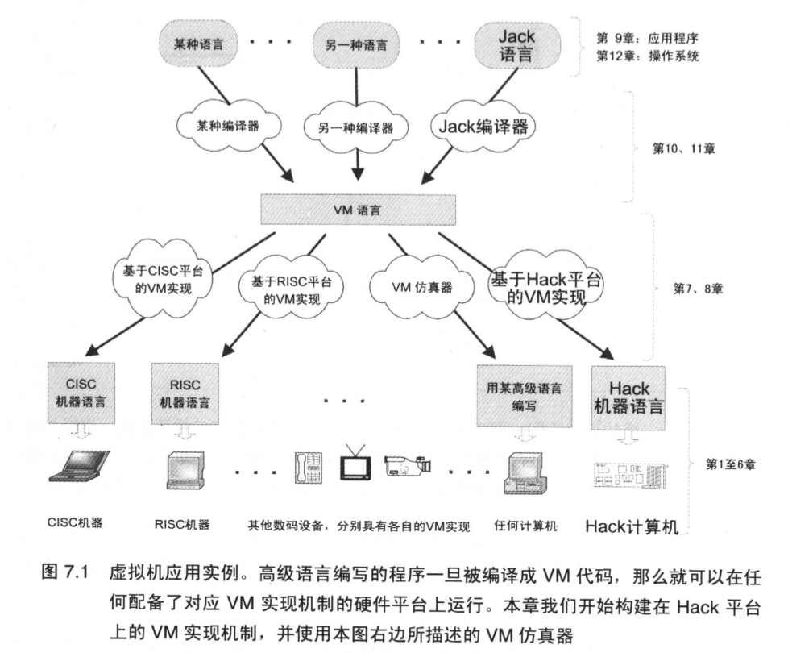

# [虚拟机Ⅰ: 堆栈运算 Stack Arithmetic]

### [背景知识]

#### 1.虚拟机范型

​		高级语言程序能够在计算机上运行之前，它必须被翻译成计算机的机器语言，即**编译**。如果每种高级语言被编译成对应于目标硬件平台的机器语言，那么我们必须维护多个版本的代码，这是一种无尽的折磨…


​		减少高级语言和机器语言**依赖性**的方法之一是将编译过程分为**两个几乎独立的阶段**。基本思想：中间代码运行在**虚拟机(virtual Machine)**上，而不是正式的硬件平台。



​		第一个阶段：高级程序被解析出来，其命令被翻译成中间结果。第二个阶段：这些中间结果被进一步翻译成目标硬件的机器语言。当然，两个编译阶段之间的接口**(接口就是中间处理步骤的精确定义)**必须仔细地进行设计。

​		原来作用为一个独立程序的编译器被分成两个独立的程序。第一个程序，编译器(Compiler)，将高级代码翻译成中间VM指令；第二个程序将这个**VM代码翻译成目标计算机硬件平台的机器语言**。

​		Java编译器也是**两层(two-tiered)结构**，它生成运行在JVM虚拟机上(也称为Java运行时环境，**Java Runtime Enviroment**)的byte-code语言。

​		明确且正式的虚拟机语言概念有很多务实的优点。首先，仅需要**替换虚拟机实现部分**（有时候称为编译器的后端程序， backend）就能相对容易地**得到不同硬件平台的编译器**。因此，虚拟机在不同硬件平台之间的**可移植性**可以实现代码效率、硬件成本和程序开发难度之间的权衡。其次，很多语言的编译器能够**共享VM后端程序**，允许**代码共享和语言互用性**。比如，某种高级语言善于科学计算，而另一种在处理用户接口方面很突出。**如果把两种语言编译到通用的VM层，那么通过使用约定的调用语法，其中一种语言的程序就能够很容易地调用另一种语言的程序**。

​		虚拟机方法的另一个优点是**模块化**。**VM的每一个改善都会立即被所有构建于其上的编译器继承**。同样地，每个安装有VM实现的数字设备都能够受益于现有软件的庞大基础。


​		将高级语言翻译成中间代码的程序可以称为**编译器前端程序**，而将中间代码翻译成机器语言的程序可以称为**编译器后端程序**。

​		比如`Java`，`Java`的源码经翻译后形成`Byte Code`文件，`Byte Code`文件是运行在`Java`虚拟机上的，而`Byte Code`文件经翻译后得到机器语言，机器语言运行在硬件平台上。因此，中间代码运行在虚拟机上，机器语言运行在硬件上。

​		编译器的后端程序负责的是将中间代码翻译成机器语言，所以它与硬件平台的关系性非常大，如果我们需要运行在不同的硬件平台上，那么机器语言就会发生变化，因此后端程序就需要改变，而前端程序不需要改变，因而虚拟机可以使语言很方便的进行**跨平台使用**。

​		在此虚拟机中，虚拟机语言共包含4种类型的指令：算术指令，内存访问指令，程序流程控制指令和子程序调用指令。

​		


#### 2.栈式计算机模型

​		在VM操作中的操作数和结果应该驻留在哪里。也许“最干净利落”的方法是将其放在**栈式(stack)**数据结构。


##### 栈式计算机模型的实现


*Logic*

```c
*sp = 17;
sp++;
```

*Hack assembly*

```haxe
@17;  // A=17
D=A;  // D=17
// *SP=D
@SP;  // A = SP
A=M;  // A = Memory[SP]: indirect address
M=D;  // M = D,( M is (*SP) )
// SP++
@SP;
M=M+1;
```


### [from VM to Assembly]

**Implementing *local***


*logic*:

```c
addr = LCL + 2;
SP--;
*addr = *SP;
```

*implement:*

```haxe
@2;
D=A;
@LCL;
D=M+D;
@addr;
M=D;
// SP--, SP is a pointer
@SP;
A=M;
M=M-1;  // SP--
D=M;  // D=SP
@addr;
A=M;  // A=addr, M=*addr
M=D;
```

##### summary:

previous *Logic* is `pop local i`, and `push local i` is similiar.

`pop local i`——>`addr = LCL + i, SP--, *addr = *SP`

`push local i` ——>`addr = LCL + i, *SP = *addr, SP++`


**implement *lcoal, argument, this, that***:


- 将函数方法局部变量和参数变量映射到`local`和`argument`段
- 将函数方法正在处理的对象属性字段和数组项(条目)映射到`this`和`that`段


`local`, `argument`, `this` 和 `that`都是同样的实现，只需要将`segment`替换就可以得到另一种。
$$
segment = \{lcoal, argument, this, that\}
$$


***implement constant:***no `pop`


- 不允许存储任何东西到`constant`段


***implement static***:class level variable


​	挑战：`static`变量应该对程序中的所有函数方法可见

​	解决方法：将其存储在`global space`全局段中

- VM翻译器必须翻译每一个VM指向的`static i`(in the file *Foo.vm*)到Hack汇编程序的`Foo.i`
- 遵循Hack汇编的语法，Hack汇编编译器将会把这些reference映射到`RAM[16], ... , RAM[255]`


*implement Memory segment:* `temp`


- 有些时候，编译器需要用一些中间变量，我们的VM提供了8个类似的变量，存储在`temp`段


**`temp`: from VM code to Assembly psudo code

8个变量存储在`RAM[5]~RAM[12]`


***implement pointer 0/1***

- 用于存储`this`和`that`段的基地址
- 当我们编写编译器时，就会知道`this`的重要性


- 通过访问`THIS`从而访问`pointer 0: this`
- 通过访问`THAT`从而访问`pointer 1: that`


##### Summary:


### [Implement]

##### **综合内存映射分析堆栈运算**

​		做好本章的项目，理解好**内存映射(Memory Map)**是关键，只有理解了内存映射才能知道去哪里取数据，将数据存储到哪里。

​		综合来看，本章的大致思路就是：从**RAM[1]~RAM[4]**中找到**基址**，根据偏移量计算出地址，再去获取数据，并将数据放入堆栈中，在栈区中完成一定操作后，再将结果从堆栈中弹出，放到指定的内存单元（这里实际上还需要计算基址和偏移量）。不同的是`temp`段，它可以直接在**RAM[5]**上加上偏移量得到存储单元的地址。

​		在整个操作过程中，如果需要使用除D寄存器和A寄存器之外的寄存器暂时存储结果的时候，就会使用到**RAM[13]~RAM[15]**的通用寄存器。


1. 按照书中推荐的实现步骤，依次实现5个.vm文件的转化
2. 对于每个步骤，先在VM Emulator中运行.vm文件和.tst测试文件，通过观察每一步跟姐VM代码中的`push`和`pop`以及各个参数的实际意义
3. 手写练习相关Hack汇编语言，对于每个`segment`段的转换，至少完成一个例子
4. 将转换过程用高级语言实现(Java/Python/…)，测试修改，抽象方法，代码复用