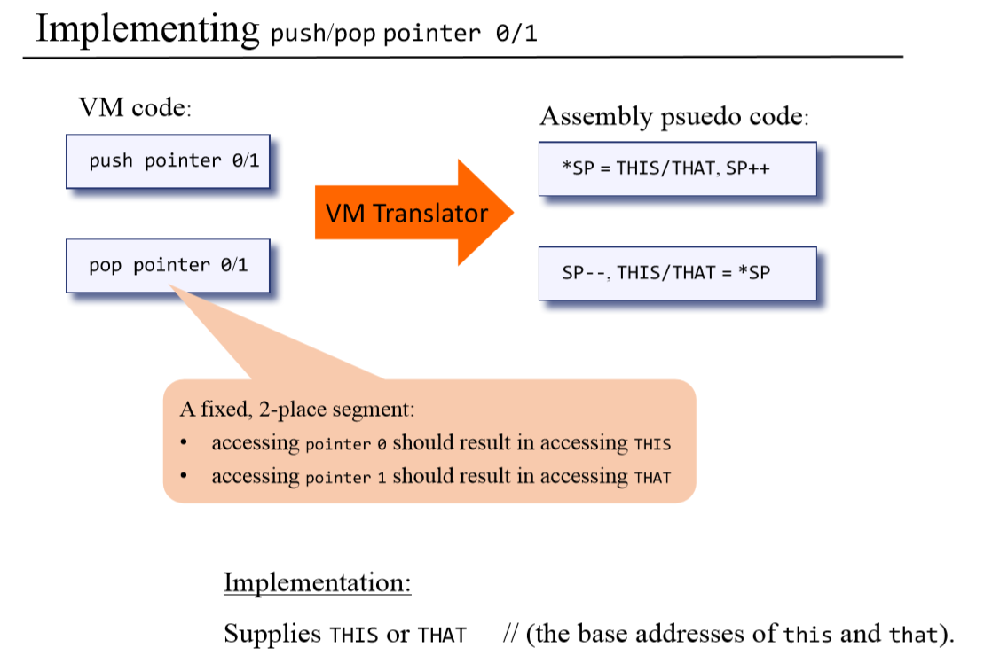

# [虚拟机Ⅰ: 堆栈运算 Stack Arithmetic]

### [背景知识]

#### 1.虚拟机范型

​		高级语言程序能够在计算机上运行之前，它必须被翻译成计算机的机器语言，即**编译**。如果每种高级语言被编译成对应于目标硬件平台的机器语言，那么我们必须维护多个版本的代码，这是一种无尽的折磨…


​		减少高级语言和机器语言**依赖性**的方法之一是将编译过程分为**两个几乎独立的阶段**。基本思想：中间代码运行在**虚拟机(virtual Machine)**上，而不是正式的硬件平台。


​		第一个阶段：高级程序被解析出来，其命令被翻译成中间结果。第二个阶段：这些中间结果被进一步翻译成目标硬件的机器语言。当然，两个编译阶段之间的接口**(接口就是中间处理步骤的精确定义)**必须仔细地进行设计。

​		原来作用为一个独立程序的编译器被分成两个独立的程序。第一个程序，编译器(Compiler)，将高级代码翻译成中间VM指令；第二个程序将这个**VM代码翻译成目标计算机硬件平台的机器语言**。

​		Java编译器也是**两层(two-tiered)结构**，它生成运行在JVM虚拟机上(也称为Java运行时环境，**Java Runtime Enviroment**)的byte-code语言。

​		明确且正式的虚拟机语言概念有很多务实的优点。首先，仅需要**替换虚拟机实现部分**（有时候称为编译器的后端程序， backend）就能相对容易地**得到不同硬件平台的编译器**。因此，虚拟机在不同硬件平台之间的**可移植性**可以实现代码效率、硬件成本和程序开发难度之间的权衡。其次，很多语言的编译器能够**共享VM后端程序**，允许**代码共享和语言互用性**。比如，某种高级语言善于科学计算，而另一种在处理用户接口方面很突出。**如果把两种语言编译到通用的VM层，那么通过使用约定的调用语法，其中一种语言的程序就能够很容易地调用另一种语言的程序**。

​		虚拟机方法的另一个优点是**模块化**。**VM的每一个改善都会立即被所有构建于其上的编译器继承**。同样地，每个安装有VM实现的数字设备都能够受益于现有软件的庞大基础。


​		将高级语言翻译成中间代码的程序可以称为**编译器前端程序**，而将中间代码翻译成机器语言的程序可以称为**编译器后端程序**。

​		比如`Java`，`Java`的源码经翻译后形成`Byte Code`文件，`Byte Code`文件是运行在`Java`虚拟机上的，而`Byte Code`文件经翻译后得到机器语言，机器语言运行在硬件平台上。因此，中间代码运行在虚拟机上，机器语言运行在硬件上。

​		编译器的后端程序负责的是将中间代码翻译成机器语言，所以它与硬件平台的关系性非常大，如果我们需要运行在不同的硬件平台上，那么机器语言就会发生变化，因此后端程序就需要改变，而前端程序不需要改变，因而虚拟机可以使语言很方便的进行**跨平台使用**。

​		在此虚拟机中，虚拟机语言共包含4种类型的指令：算术指令，内存访问指令，程序流程控制指令和子程序调用指令。

​		


#### 2.栈式计算机模型

​		在VM操作中的操作数和结果应该驻留在哪里。也许“最干净利落”的方法是将其放在**栈式(stack)**数据结构。


##### 栈式计算机模型的实现


*Logic*

```c
*sp = 17;
sp++;
```

*Hack assembly*

```haxe
@17;  // A=17
D=A;  // D=17
// *SP=D
@SP;  // A = SP
A=M;  // A = Memory[SP]: indirect address
M=D;  // M = D,( M is (*SP) )
// SP++
@SP;
M=M+1;
```


### [from VM to Assembly]

***push & pop* implementation:**


***stack* implementation**


***implement constant:***no `pop`


- 不允许存储任何东西到`constant`段


**Implementing *local***


*logic*:

```c
addr = LCL + 2;
SP--;
*addr = *SP;
```

*implement:*

```haxe
@2;
D=A;
@LCL;
D=M+D;
@addr;
M=D;
// SP--, SP is a pointer
@SP;
A=M;
M=M-1;  // SP--
D=M;  // D=SP
@addr;
A=M;  // A=addr, M=*addr
M=D;
```

##### summary:

previous *Logic* is `pop local i`, and `push local i` is similiar.

`pop local i`——>`addr = LCL + i, SP--, *addr = *SP`

`push local i` ——>`addr = LCL + i, *SP = *addr, SP++`


**implement *lcoal, argument, this, that***:


- 将函数方法局部变量和参数变量映射到`local`和`argument`段
- 将函数方法正在处理的对象属性字段和数组项(条目)映射到`this`和`that`段


`local`, `argument`, `this` 和 `that`都是同样的实现，只需要将`segment`替换就可以得到另一种。
$$
segment = \{lcoal, argument, this, that\}
$$


***implement static***:class level variable


​	挑战：`static`变量应该对程序中的所有函数方法可见

​	解决方法：将其存储在`global space`全局段中

- VM翻译器必须翻译每一个VM指向的`static i`(in the file *Foo.vm*)到Hack汇编程序的`Foo.i`
- 遵循Hack汇编的语法，Hack汇编编译器将会把这些reference映射到`RAM[16], ... , RAM[255]`


*implement Memory segment:* `temp`


- 有些时候，编译器需要用一些中间变量，我们的VM提供了8个类似的变量，存储在`temp`段


✨✨`temp`: from VM code to Assembly pseudo code

8个变量存储在`RAM[5]~RAM[12]`


***implement pointer 0/1***

- 用于存储`this`和`that`段的基地址
- 当我们编写编译器时，就会知道`this`的重要性



- 通过访问`THIS`从而访问`pointer 0: this`
- 通过访问`THAT`从而访问`pointer 1: that`


##### Summary:


### [实现]

##### **综合内存映射分析堆栈运算**

​		做好本章的项目，理解好**内存映射(Memory Map)**是关键，只有理解了内存映射才能知道去哪里取数据，将数据存储到哪里。

​		综合来看，本章的大致思路就是：从**RAM[1]~RAM[4]**中找到**基址**，根据偏移量计算出地址，再去获取数据，并将数据放入堆栈中，在栈区中完成一定操作后，再将结果从堆栈中弹出，放到指定的内存单元（这里实际上还需要计算基址和偏移量）。不同的是`temp`段，它可以直接在**RAM[5]**上加上偏移量得到存储单元的地址。

​		在整个操作过程中，如果需要使用除D寄存器和A寄存器之外的寄存器暂时存储结果的时候，就会使用到**RAM[13]~RAM[15]**的通用寄存器。

***Review:***

1. `@X`的意义为把`X`存入A寄存器，M代表的是`Memory[A]`，即A映射的地址中所存的值。
   `A=M, M=D`两句意味着1. A更新为M寄存器存储的数据所指向的地址，2.将D寄存器存储的的数据存入`Memory[A]`，这是这一章中用得最多的逻辑语句。

2. 在实现`eq`, `gt`, `lt`时，需要用汇编语言实现`if`分支，这里需要用到两个`lable`，一个**有条件**`jump`，一个**无条件**`jump`，代码实现为：

   ```haxe
   // Compare R1=R2 set result in R3
   @SP
   AM=M-1
   D=M
   A=A-1
   D=M-D
   @RET_TRUE
   D;JEQ
   @SP         // need to return False
   A=M-1
   M=0
   @CONTINUE
   0;JMP
   (RET_TRUE)
   @SP        // need to return True
   A=M-1
   M=-1
   (CONTINUE)
   ```
   
   
   
3. `push segment i`的实现：`addr = segmentPointer+i, *SP = *addr, SP++`

   ```haxe
   @segmentPointer
   D=M
   @index
   A=D+A
   D=M
   @SP
   A=M
   M=D
   @SP
   M=M+1
   ```

   `pop segment i`的实现：`addr = segmentPointer+i, SP--, *addr = *SP`

   ```haxe
   @segmentPointer
   D=M
   @index
   D=D+A
   @R13
   M=D
   @SP
   AM=M-1
   D=M
   @R13
   A=M
   M=D
   ```

   `push/pop temp i`的实现

   push: `addr = 5 + i, *SP = *addr, SP++`

   ```haxe
   @5+index
   D=M
   @SP
   A=M
   M=D
   @SP
   M=M+1
   ```

   pop:  `addr = 5 + i, SP--, *addr = *SP`

   ```haxe
   @SP
   AM=M-1
   D=M
   @5+index
   M=D
   ```

   

   

4. `push pointer 0/1`的实现：`*SP = THIS/THAT, SP++`

   `pop pointer 0/1`的实现：`SP--, THIS/THAT = *SP`

   与temp类似

5. `push/pop static i`的实现：`@vmName.index ...`

   与temp类似


***Recommand:***

1. 按照书中推荐的实现步骤，依次实现5个.vm文件的转化
2. 对于每个步骤，先在VM Emulator中运行.vm文件和VME.tst测试文件，通过观察其每一步是如何实现的，深入理解VM语言中`push`，`pop`和各个参数的实际意义
3. 手写练习相关Hack汇编语言，对于每个`segment`段的转换，至少完成一个例子
4. 将转换过程用高级语言实现(Java/Python/…)，测试修改，抽象方法，代码复用


***Tips:***

1. 第七章中的机器语言和第六章中的机器语言在结构上略有不同，这一章中的语言更加向高级语言靠拢，在有些地方显得“啰嗦”

   `push constant 7`需要如此多的汇编语言实现，但是其中每一句话都是有意义的，所以一定要理解每一句VM语言究竟做了哪些事

   ```haxe
   @7          // constant 7
   D=A         // D=7
   @SP         // A=栈顶指针=RAM[0]
   A=M         // A=Memory[A], A更新为M存储的数据所指向的地址
   M=D         // Memory[A]=D
   @SP         // A=栈顶指针
   M=M+1       // 栈顶指针++
   ```
   
   `pop constant 7`
   
   ```haxe
   @7
   D=A
   @SP
   M=M-1
   A=M
   M=D
   ```
   
   
   
2. 因为一个vm文件中可能会同时出现许多`eq`，`lt`这样的涉及`jump`的语句，如果每一个`lable`都相同的话，那么`lable`就会产生重复冲突，如：

   ```haxe
   @Label
   ...
   (Label)
   ...
   @Label
   ...
   (Label)
   ```

   当机器到达第一个`@lable`点时，就会跳到最后一处`(lable)`。为了避免这种情况，需要给不同的`lable`依次加上编号，如`lable1`，`lable2`，这里可以使用定义全局变量来实现。


3. 翻译`pop segment index`的过程中，首先需要获取`segment`中存储的地址，然后将`index`加在这个地址上，得到目标地址。最后把当前`SP`所指向的地址中的值弹入这个目标地址。这个过程是无法用机器语言直接实现的，因为当中涉及两次调用寄存器D。唯一的解决方案就是在翻译过程中用`index`控制循环语句，让其自动添加`index`次A=A+1，这样的话就免去了多次调用D寄存器的困难。

*Parser.java*

```java
/**
 * 分析.vm文件，封装对输入代码的访问操作
 * 读取vm指令并解析，然后为它各个部分提供方便的访问入口
 * 移除代码中所有空格和注释
 */
class Parser{
    // variable: 文件扫描、当前指令、当前文件名
    // 算术指令的字符串数组
    // Paser模块基本函数：构造函数、更多指令、advance、commandType()区分指令类型、返回指令第一个参数、返回指令第二个参数
    // 当前指令长度
    // 返回完整指令
    // 设置和获取文件名
    // 关闭资源
    // 判断是否为算术指令  used in commandType()
}
```

*VMTranslator.java*

```java
class VMTranslator{
    // 需要解析的.vm文件数组链表，处理无.vm文件的情况
    // getParser(File): 根据File文件对象创建Parser对象，与chap6类似
    // printCommandLineErrorAndExit(): 命令行错误处理
    // 判断命令行是否正确，错误则调用函数处理
    // 检查提供的命令行参数，以确定它是有效的文件或目录(1.不存在，2.文件，3.目录)
    // if 1.输出错误
    // else if 2.确定是.vm文件，获取Parser对象，并解析指令参数(路径+文件名)初始化Parser对象的文件名; 调用翻译函数
    // else if 3.将指令参数arg[0]映射路径下的所有文件转换成File对象，并用File[]数组存储; 遍历所有文件，找出.vm文件并根据File获取Parser，依据.vm文件File对象设置Paser对象文件名，设置输出文件名(绝对路径+'/'+文件名+'.asm')，调用函数翻译成.asm文件，并把该文件加入到数组链表
    // 			if 若Parser对象的数组链表为空则输出错误并退出
    // else 4.错误处理
    
    // writeVM2ASM(String, Parser): 置空CideWriter对象，根据String构造PrintWriter对象，再由其构造CodeWriter对象，并从parser获取文件名设置CodeWriter对象的文件名。
    // 还有命令:向前，跳空白，parser长度为0下一循环，若parser的命令类型是'push'或'pop'则调用codewriter对象写入Push和Pop相应的ASM指令，算术指令调用相应的函数
    // finally 释放parser和codewriter资源
}
```

*CodeWriter.java*

```java
class CodeWriter{
    // PrintWriter对象、当前文件名、区分分支标签的数字
    // 构造函数(PrintWriter): 区分分支标签的数字置零
    // 设置翻译出来的的.vm文件的文件名(提取出文件名)
    // writeArithmetic(String command): 将给定的算术操作所对应的汇编写到输出文件
    // writePushAndPop(Parser.Command command, String segment, int index): 
    //   1.constant: @idnex, D=A, 将D寄存器的值存储在SP所指向的内存单元, SP++
    //   2.local,argument,this,that: 
    //     (1)push: (addr = segmentPointer+i, *SP = *addr, SP++)
    //             获取对应(segmentPointer+i)所指向的地址,M[SP]获取对应的值,SP++
    //     (2)pop: (addr = segmentPointer+i, SP--, *addr = *SP) 需要借助R13存储中间值
    //             获取对应(segmentPointer+i)所指向的地址,SP--,对应的内存单元获取M[SP]的值
    //   3.temp: 
    //     (1)push: (addr = 5+i, *SP = *addr, SP++)
    //     (2)pop: (addr = 5+i, SP--, *addr = *SP)
    //   4.pointer: 
    //     (1)push pointer 0/1: (*SP = THIS/THAT, SP++) 根据0/1决定THIS/THAT
    //     (2)pop  pointer 0/1: (SP--, THIS/THAT = *addr)
    //   5.static:
    //     (1)push: (*SP = fileName.index, SP++)
    //     (2)pop: (SP--, fileName.index = *SP)
    // segment: local,argument,this,that  
    //   void writeBasePush(String segmentPointer, int index)
    //   void writeBasePop(String segmentPointer, int index)
    // poiner, static, temp
    //   void writeMappedPush(String location)
    //   void writeMappedPop(String location)
}
```

