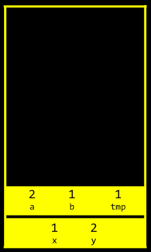
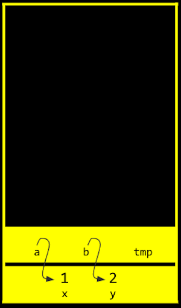

# C语言程序的内存布局

### 内存布局

- 在我们的计算机内存中，需要为程序存储的不同类型的数据分为不同的部分：

  

  - **机器码**部分是我们的已编译程序的二进制代码。当我们运行程序时，该代码将被加载到内存的“顶部”。
  - **全局变量**是我们在程序中声明的全局变量或整个程序可以访问的其他共享变量。
  - **堆**部分是一个空区域，`malloc`可以从中获取可用内存，供程序使用。`Dynamic Memory`动态申请的内存将存放在**堆**。
  - **栈**部分由程序中的函数调用时使用。`function`任何函数和`Local Variables`本地变量 都将存放在**栈**，函数体内再进行函数调用将会在原本的栈区之上再叠一层，因为每个函数都有自己的主存区域。
  - 例如，我们的`main`函数位于**栈**的最底部，而`main`调用的其他函数一层一层往上堆叠。

  -------------------

  ❌交换函数：交换的只是传入的变量的副本。

  ```c
  void swap(int a, int b)
  {
      int tmp = a;
      a = b;
      b = tmp;
  }
  ```

  - 例如，我们的`main`函数位于栈区的最底部，并且具有局部变量`x`和`y`。 调用交换函数时，它具有自己的存储框架或内存片，位于主存储器的顶部，具有局部变量`a`，`b`和`tmp`。

  - 一旦函数交换返回，它所使用的内存将被释放以用于下一个函数调用，除了返回值，我们将丢失所做的所有事情，并且程序将返回称为交换的函数。

  

  - 因此，通过将`x`和`y`的地址从`main`传递到`swap`，我们实际上可以更改`x`和`y`的值：

  

```c
#include <stdio.h>
void swap(int *a, int *b);
int main(void)
{
    int x = 1;
    int y = 2;
    swap(&x, &y);
}
void swap(int *a, int *b)
{
    int tmp = *a;
    *a = *b;
    *b = tmp;
}
```

- 
  - `x`和`y`的地址从`main`传递到`swap`，并且我们使用`int *a`语法声明我们的`swap`函数接受指针。 我们通过跟随指针`a`将`x`的值保存到`tmp`，然后通过跟随指针`b`取`y`的值，并将其存储到`a(x)`所指向的位置。 最后，我们将`tmp`的值存储到`b(y)`所指向的位置，然后完成。
- 如果调用`malloc`的次数过多，则会发生堆溢出，最终导致溢出到栈区。 或者，如果调用的函数过多，则会发生堆溢出，其中堆也分配了过多的内存帧。 这两种类型的溢出通常称为缓冲区溢出，之后我们的程序（或整个计算机）可能崩溃。


### 未分配内存的指针

```c
int main(void) 
{
    int *x;
    int *y;
    x = malloc(sizeof(int));
    *x = 42;
    *y = 13;
}
```

`y`没有被分配内存，最终程序将会出错。此时的`y`其实是garbage，保存了垃圾值。